# BSC EXCLUSIVE — Enterprise Operations Portal
# Complete User Manual

**Project:** BSC EXCLUSIVE — Multi-Location Wedding CRM & Store Operations Platform (BSC v3.0)
**Manual Version:** 2.0
**Date:** 22 September 2026
**Prepared from:** the actual production code, live screens, and database structure of this project. Every feature, message, and rule documented here was verified against the implementation.

> **Confidentiality:** This manual never documents passwords, secret keys, tokens, or database credentials. Where a protected value exists, the manual describes only its purpose.

---

## Table of Contents

**Part I — Getting Started**
1. Introduction
2. Purpose of the System
3. System Overview
4. Supported Store Locations
5. User Roles
6. Login and Authentication
7. First-Login Consent (Privacy Policy & Terms)
8. Navigation and Sidebar
9. Location Selection (Branch Scope)
10. Session Handling and Logout

**Part II — Users, Roles and Permissions**
11. User Account Management (Admin)
12. Access Control Matrix (Per-User Permissions)
13. Page Visibility Matrix (Per-Role)
14. How Permissions Are Enforced
15. Password Reset (Self-Service) and Account Locks

**Part III — Dashboards**
16. Admin / HR / Manager / Greeter Dashboard (one page, four views)
18. Where Every Metric Comes From

**Part IV — Wedding CRM**
19. Wedding CRM Overview and Status Vocabulary
20. Wedding CRM Dashboard
21. Customer Register (List, Search, Filter, Export)
22. New Wedding Customer Registration (Form, Field by Field)
23. Customer 360 Profile
24. Telecaller Desk
25. Call Logging and Automatic Status Transitions
26. Follow-up Calendar
27. Status Board (Pipeline / Kanban)
28. Call History, Reports and Exports
29. Bulk CSV Import
30. Public Wedding Registration Portal (Customer-Facing)
31. Track Wedding Request (Public)
32. Store Landing Page Enquiries
33. Wedding Operations Desk

**Part V — Feedback and QR**
34. Feedback QR Code Management
35. QR Display Screen and Scan Tracking
36. Public Customer Feedback Survey (QR Target)
37. Feedback Collection and Resolution Workspace
38. Feedback Call Queue Desk

**Part VI — Store Operations**
39. Hourly Footfall
40. VM Checklist (Visual Merchandising Audit)
41. Daily MCheck, MCheck Reports and History
42. Sourcing Diverts and Purchase Manager View
43. Cash Settlement Desk
44. Greeter Kiosk and Live TV Display
45. Attendance & Roster
46. Broadcast Center
47. Kiosk PINs and Security Administration
48. Internal Chat

**Part VII — Talent (HRMS Modules Still in Service)**
49. Candidate CRM
50. Manpower Planning (Openings)
51. Department Hiring Status & Section Allocation
52. Employee & Store Directory
53. DOJ & Not Joined Desk
54. Batch Plan (Weaving Training Batches)
55. Job Applicant Registration (Public)
56. Retired Modules (Important Note)

**Part VIII — Operating Procedures and Reference**
57. Search, Filter and Sorting Conventions
58. Forms and Validation Rules
59. Success and Error Messages Reference
60. Database and Data Flow Explained
61. Complete End-to-End Workflows (A–F)
62. Role Responsibilities and Data Ownership Matrix
63. Daily Operating Procedures (Admin / Telecaller / Manager / Floor Manager)
64. Security and Access Control Model
65. Troubleshooting
66. Frequently Asked Questions
67. Feature Status Notes — What Is and Is Not Implemented
- Appendix A — Screenshot Guides (15 screens, annotated)
- Appendix B — Record ID Formats

---

# PART I — GETTING STARTED

## 1. Introduction

BSC EXCLUSIVE is the enterprise operations platform of BSC Textiles, running the company's wedding-shopping customer relationship management (CRM), customer-feedback collection, store-operations auditing, and talent-acquisition workflows across three retail stores. The system is a single integrated portal: one login gives every employee access to exactly the modules their role and store assignment allow, and every action is written to an audit trail.

The portal is used by store owners, administrators, managers, telecallers, visual merchandisers, greeters, HR staff, and floor staff — from registering a bride's wedding shopping requirement, through phone follow-ups, to confirming a store visit and recording the sale.

## 2. Purpose of the System

1. **Capture and manage wedding-shopping leads.** Every customer who plans to buy textiles for a wedding is registered once and then followed up by an assigned telecaller until the shopping is confirmed, visited, or closed.
2. **Enforce location discipline.** Each store's data is isolated; a Davanagere user cannot see Belagavi customers, and all dashboards recalculate when the location switcher changes.
3. **Close the feedback loop.** Customers scan a QR code in the store, answer a 5-question survey, and any negative response is automatically escalated to a telecaller call queue with SLA tracking.
4. **Run the store day.** Hourly footfall counting, visual-merchandising floor audits (VM Checklist), and the Daily Management Checklist (MCheck) with reports and history.
5. **Manage people.** User accounts, granular per-module permissions, roles, page visibility, kiosk PINs, and security monitoring are all Admin-controlled inside the portal.
6. **Support legacy HR workflows.** Recruitment (candidates, openings, department hiring, offers desk), employee directory, attendance and training batches remain in service.

## 3. System Overview

The platform has three layers, all working behind one web address:

| Layer | What it does (user-level explanation) |
|---|---|
| **Web portal (React)** | The screens you use — login, dashboards, forms, tables. Works on desktop and mobile browsers. |
| **Server API (Node.js)** | Checks your login, your role, your permissions and your store on **every** request; validates all data a second time; applies anti-abuse limits. Nothing shown in the portal is trusted from the browser alone. |
| **Database (MySQL)** | Stores accounts, customers, call logs, feedback, QR codes, checklists and audit trails. Structured to keep each store's data separate and to keep history (status changes, deletions are archived, not erased). |

Key platform-wide behaviors:

- **Single-page portal.** The address changes but pages load instantly; browser Back works.
- **Live updates.** Important events (negative feedback, shield changes, alerts) are pushed to open sessions in real time (Socket.IO).
- **Offline awareness.** If the internet drops, a ConnectivityBanner appears; the app shows "You are offline" states instead of silently failing.
- **Global search.** `Ctrl+K` (or the "Search directory..." button) opens a search across people, customers and pages.
- **Quick Action Center.** A floating action launcher for frequently used operations on the current page.
- **Toasts.** Every create/update/delete produces a message at the top-right (success = green, error = red, info = blue, warning = amber).

## 4. Supported Store Locations

Three stores are pre-provisioned in the system (they are re-verified at every server start):

| # | Code | City | Store name shown in UI |
|---|---|---|---|
| 1 | **BEL** | Belagavi | BSC Textiles Belagavi |
| 2 | **DAV** | Davanagere | BSC Textiles Davanagere *(default for new records)* |
| 3 | **SHI** | Shivamogga | BSC Textiles Shivamogga |

- Every user account is assigned to one (or more) stores, or marked **Global** (Admin/Super Admin pattern).
- Nearly every business record (customers, calls, feedback, footfall, diverts, settlements, VM audits, QR codes…) carries the store it belongs to.
- "All Locations" views exist only for global administrators; store users are automatically restricted, and the server silently rejects queries for a store they do not belong to (`Access denied: you do not have permission to access data for this location`).

## 5. User Roles

These roles are actually implemented in the portal's access-control code. The first group is the core operational set:

| Role | What it is for |
|---|---|
| **Super Admin** | Full system owner. Sees every module, every location, all security tools. Cannot be restricted by permission settings. |
| **Admin** | Same module breadth as Super Admin; manages users, permissions, settings, QR codes, and all CRM data. |
| **Manager** | Store-level supervisor: wedding CRM, telecaller desk, store-ops audits, feedback, attendance, employee directory; also sees the User Management screen (role map), subject to Admin-set visibility. |
| **Floor Manager** | Identical module set to Manager (role aliases "store manager", "department manager" resolve the same way). |
| **HR** | Talent modules (candidates, openings, hiring, employees, attendance) plus store operations and wedding CRM viewing. |
| **Telecaller** | The calling workspace only: Telecaller Desk, Customer Register (own queue), Register Wedding Customer, and the wedding CRM. Daily target of 40 calls is measured against their name. |
| **VM Extension Telecaller** | Treated exactly like a Telecaller (alias); calling desk plus wedding registration. |
| **Team Lead** | Wedding CRM, dashboard, wedding registration, employees, section allocation, broadcast. |
| **Wedding Collection Manager** | Wedding CRM and operations, dashboard, registration, footfall, diverts, broadcast. |
| **CRM Manager** | Wedding CRM operations suite: CRM, registration, telecaller desk, dashboard, footfall, broadcast. |
| **CRM Executive** | Same suite as CRM Manager minus broadcast. |
| **Data Analyst** | Read-oriented: dashboards, wedding CRM & operations, MCheck reports, regional analytics. |
| **VM (Visual Merchandiser)** | VM Checklist, dashboard, footfall, broadcast. |
| **Greeter** | Entrance kiosk duties: Footfall, Greeter Kiosk, Feedback QR display/submission pages, wedding registration. Greeters land on the greeter view of the dashboard. |
| **Recruiter** | Candidate CRM, dashboard, broadcast, applicant registration link. |
| **Interviewer** | Candidate CRM only (evaluation). |
| **Employee** | Dashboard, wedding CRM view, wedding registration. |
| **Guest** | Public flows only (wedding registration, job application). |

The database additionally seeds auxiliary role names (e.g. *HR Manager*, *Employee*, *Interviewer*, *Recruiter*) and custom designations such as "Floor Manager" exist in the Designations master — a designation is a job title, not an access level; access follows the role.

**Aliases are normalized:** `tele caller`, `tele-caller`, `vm telecaller` → Telecaller; `system administrator` → Super Admin; `store manager` / `department manager` → Manager; `hr manager` → HR; `visual merchandiser` → VM.

## 6. Login and Authentication

*Figure — Login card: username/email, password with reveal toggle, one-time numeric captcha with auto-refresh note, and the public wedding buttons below.*

### 6.1 Step-by-step login

1. Open the portal address in a browser. You arrive at the login card: **"Welcome Back — Sign in with your authorized system credentials. Your location will be loaded automatically."**
2. **Username / Email** — enter your assigned username or your email address (either works; matching is case-insensitive).
3. **Password** — type it, or press the eye icon to reveal. (Client-side check: minimum 4 characters are required before the request is sent; message shown: *"Password must be at least 8 characters long and contain letters, numbers, and special characters."*)
4. **Security Code (captcha)** — a distorted 4-digit numeric code is drawn server-side. Type the digits. The code:
   - refreshes automatically every 30 seconds (*"Refreshes automatically in {n}s for your security."*),
   - can be refreshed manually via the reload button ("Load a new security code"),
   - is valid for 90 seconds and is **one-time use** — any verification attempt consumes it.
5. Press **Sign In**.

### 6.2 What the server checks, in order

1. **Account/IP lock** — if a previous lock is active: *"Account locked due to 5 consecutive failed attempts. Please try again in 10 minutes."* (HTTP 423 with remaining time).
2. **Bot pattern** — five login attempts fired less than 800 ms apart flag automated abuse: *"Suspicious request pattern detected. Access temporarily restricted. Please try again later."* (HTTP 429). Production also rejects automation user-agents (curl, python-requests, Postman, empty).
3. **Captcha** — wrong or expired code → 401 with a fresh code: *"Incorrect captcha. A new one has been generated - please try again."* / *"The captcha expired…"*
4. **Credentials** — bcrypt comparison against the account row (stored hashes only). Wrong combination → *"Incorrect username or password"* (deliberately generic: the system never reveals whether the username exists).
5. **Account state** — deactivated accounts are told: *"Your account has been deactivated. Please contact administrator."*

### 6.3 After 5 failures — temporary lock

Five consecutive wrong passwords lock the account **and** your IP for **10 minutes**. The login card then shows an "Account Temporarily Locked" panel with a live `MM:SS` countdown ("Remaining Lock Time:"), the fields are disabled and the button reads `Locked (MM:SS)`. An Admin can unlock you earlier from System Administration → *Unlock Account*.

### 6.4 Successful login

- A session token (JWT) is issued that embeds your **role**, your **assigned location(s)**, and whether you are a **Global Admin**. The session lasts **6 hours** (absolute; configured by the administrator).
- You are greeted: `Welcome back, {Full Name} — {City}`.
- The portal records your sign-in (audit log + login-activity statistics) and, with your browser's permission, an approximate GPS ping for the security trail (best-effort; never blocks login).
- You are redirected to the correct dashboard for your role: Telecaller-family roles → Telecaller Desk; Greeter → dashboard greeter view; VM → dashboard; everyone else → the Admin/HR/Manager dashboard.

### 6.5 Failed login messages (what they mean)

| Message on screen | What happened | What to do |
|---|---|---|
| *Authentication failed. Please check your credentials.* | Wrong username/email or password | Re-type; check caps-lock; after 3 tries you see "(N attempts remaining before 10-minute lock)" |
| *Incorrect captcha…* | Security code wrong/expired/already used | Re-read the displayed digits |
| *Account temporarily locked due to too many failed attempts…* | 423 lock active | Wait for the countdown or ask Admin to unlock |
| *Too many requests. Please wait and try again.* | 429 abuse limiter | Wait ~1 minute |
| *Sign-in failed. Please check your details and the captcha.* | Generic fallback | Retry once; then contact support |

### 6.6 Public shortcuts on the login screen

Below the form, two doors open without login: **"Register for Wedding Shopping"** (public customer wizard, §30) and **"Track Wedding Request"** (§31). Footer links: "Forgot password?", "Privacy Policy", "Terms".

## 7. First-Login Consent (Privacy Policy & Terms)

After signing in (not on public pages), an employee sees the Consent modal once per policy version: accept the Privacy Policy and Terms to continue. Acceptance is stored (date + version) and visible in the user's audit panel; closing the modal does not grant access. "Consent Status" per user is shown in the User Management audit dialog (Accepted vX / Not Accepted).

## 8. Navigation and Sidebar

*Figure — Mobile layout: the rail becomes a drawer and tables reflow to cards.*

The left rail is dark navy with gold accents and can collapse to an icon strip (the state is remembered). Its header shows the logo and your active branch scope ("🌐 ALL LOCATIONS" or "📍 DAVANAGERE"); its footer shows your initials/role and **Sign Out**.

Sections and items exactly as configured (you only see what your role + Admin settings allow):

| Section | Items (label → page) |
|---|---|
| **Telecaller Workspace** *(telecaller-family only)* | Telecaller Desk · Customer Register · Register Wedding Customer |
| **Enterprise** | Admin Dashboard · Employee & Store Directory · User Management · Attendance & Roster |
| **Store Operations** | Wedding CRM · Telecaller Desk · Wedding Customer Registration · Wedding Operations · Hourly Footfall · Feedback Collection · Feedback Call Queue · Feedback QR Code · Sourcing Diverts · Purchase Manager View · VM Checklist |
| **Talent** | Candidate CRM · Manpower Planning · Department Hiring Status · Section Allocation |
| **Daily Operations** | MCheck Store Audit · MCheck Reports · MCheck History |
| **Administration** | Broadcast Center · System Settings · System Administrator |
| **Public Portals** | Job Applicant Registration (opens `/apply` in a new tab) · Customer Feedback QR · Live TV Kiosk · Greeter Kiosk |

- Wedding CRM items carry a **NEW** pill.
- The Wedding CRM pages have their own inner tab bar: **Dashboard · Customer Register · Add Customer · Telecaller Desk · Call History · Calendar · Status Board · Reports · Import**, with the breadcrumb "BSC Portal › Wedding CRM › …".
- Top bar (all pages): page title, live clock, **Global search** ("Search directory…", `Ctrl+K`), Live Activity panel, notification bell with unread badge, profile dropdown, the **Location Switcher**, and — for Admins — the DevTools-shield status control (§64.5).
- Mobile: the sidebar becomes a drawer (swipe/Escape closes it); tables reflow to card layouts.

## 9. Location Selection (Branch Scope)

The Location Switcher in the top bar is titled "Select Branch Scope" and lists **ALL** (global admins only) plus each store.

- Choosing a store fires a `bsc location changed` event; every open list, dashboard and queue immediately re-loads filtered to that store — this is why two managers on the same screen can see different numbers.
- Your selection persists between visits (per browser).
- Non-global users are validated against their allowed stores: an out-of-scope selection is silently reverted to an allowed store.
- Every API call carries your active location; the server re-checks it against your token — the client cannot forge scope.

## 10. Session Handling and Logout

*Figure — ConnectivityBanner shown when the connection drops; the portal retries automatically.*

- Sessions expire **6 hours** after login, no matter what. A SessionTimeoutGuard checks every 60 seconds and returns you to the login screen at expiry; the security log records a `SESSION_EXPIRED` event.
- **Sign Out** (sidebar footer or profile menu) revokes the token server-side immediately and records a `LOGOUT` audit row.
- An Admin can **force-logout** anyone (System Administration); the next API call from that session fails and the user is bounced to login.
- Deactivating or deleting a user takes effect on their live sessions within seconds (each API call re-checks the account status; invalidated sessions get *"Session has been invalidated. Please log in again."* or *"Your account has been deactivated. Contact a system administrator."*).
- If you try to open a page your role may not see (by typing the URL, for example), the portal forces a security logout and returns you to: **"Unauthorized Access Detected — You have been logged out for attempting to access a restricted area… This incident has been recorded in the security audit log."** Repeated violations can lead to suspension.

---

# PART II — USERS, ROLES AND PERMISSIONS

## 11. User Account Management (Admin)

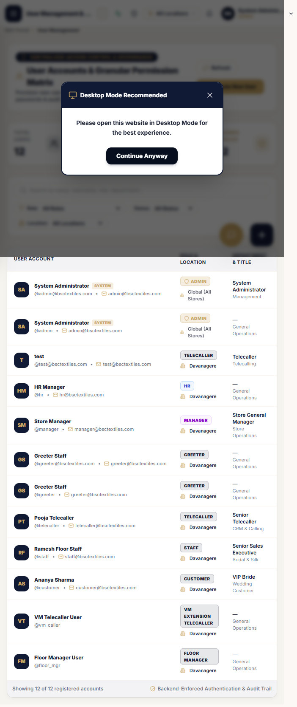
*Figure — User Management: KPI strip, filters, account table with inline location dropdown, status pills and the five row actions.*

**Route:** `/user-management` · **Who:** Admin, Super Admin (and Manager/HR/Floor Manager only if page visibility allows) · **Sidebar:** Enterprise → User Management.

Header: "User Accounts & Granular Permission Matrix", badge "Centralized Access Control & Governance". Buttons: **Refresh**, **Create New User** (gold).

### 11.1 KPI strip

Four cards computed from the loaded list: **Total Users**, **Active Accounts**, **Deactivated**, **Admin Roles**.

### 11.2 Finding users

- Search: *"Search by name, username, role, department…"* — matches username, full name, email, department, designation, role.
- Filters: **Role:** (All Roles + every known role), **Status:** (All Status / Active Only / Inactive Only), **Location:** (All Locations / Global / All Stores / each store).
- Footer: "Showing {n} of {m} registered accounts".

### 11.3 The user table

| Column | Contents |
|---|---|
| User Account | initials avatar, full name, `@username`, email; built-in administrator shows a "System" badge |
| Role & Location | role badge; the location is an **inline dropdown** (🌐 All Locations / 📍 {Store} {CODE}); the built-in Admin row shows "Global (All Stores)" and is locked ("Admin locations are managed via role") |
| Department & Title | designation / department (defaults "—" / "General Operations") |
| Modules Assigned | Admin: "All Modules (Bypass)"; others: "{n} Modules" (+ "Limit: {max} max" when set) |
| Status | clickable **Active/Inactive pill** toggles the account (built-in admin cannot be deactivated) |
| Last Login | timestamp or "Never logged in" |
| Actions | five icons (below) |

### 11.4 Button by button

| Button (icon tooltip) | What it does | Result message |
|---|---|---|
| **Create New User** | opens the create form (§11.5) | `User account "{username}" created successfully` |
| **Configure Module Access Matrix** | opens the permission matrix (§12) | `Permissions matrix for "{username}" saved successfully` |
| **Edit User Information** | opens the edit form (§11.6) | `User "{username}" profile updated successfully` |
| **Reset User Password** | opens the reset dialog (§11.7) | `Password for "{username}" has been reset securely` |
| **View User Audit Log** | consent status + the user's audit cards (action, module, details, time, IP) | "No audit log records found for this user" when empty |
| **Delete User Permanently** | hard delete with confirmation (hidden for the built-in admin) | `User "{username}" removed permanently` |
| Status pill click | activate/deactivate the account | `User "{username}" is now Active` / `… now Inactive` |
| Location dropdown change | re-scopes the account to another store | `Location for "{username}" changed to {label}` |

### 11.5 Create New User — every field

| Field | Required | Rules / values |
|---|---|---|
| Username | ✅ | 3–100 chars; letters, numbers, `. _ @ + -` and spaces; unique (duplicate → `Username already exists`, HTTP 409) |
| Password | ✅ | "Min. 6 characters" — 6-character minimum enforced on the server |
| Full Name | ✅ | 2–150 characters |
| Role | ✅ | dropdown of all roles (§5). Choosing Admin/Super Admin auto-checks All Locations |
| Email Address | – | must be a valid email; unique (`A user with this email address already exists`) |
| Phone Number | – | +91 prefix, 10 digits starting 6–9; normalized to +91 format on save |
| Employee ID | – | unique (`This Employee ID is already assigned to another user`) |
| Department | – | Sales, HR, Cashier, Admin, Management, Operations, Marketing, IT, Customer Support, Visual Merchandising, Logistics/Stock, Telecalling, Security |
| Designation | – | Store Manager, Assistant Store Manager, Sales Executive, HR Executive, HR Manager, Cashier, Head Cashier, Floor Manager, Greeter, System Admin, Admin Assistant, Telecaller, Team Leader, Security Guard, Visual Merchandiser, Inventory Manager, Accountant |
| Section / Floor | – | free text ("e.g. Ground Floor Saree, Silk Section, Cash Counter") |
| Date of Joining | – | date picker |
| **Assigned Locations** | – | "All Locations" checkbox + per-store boxes (Belagavi (BEL), Davanagere (DAV), Shivamogga (SHI)) |
| **Initial Module Access** | – | checkbox grid of every module with **Select All**; newly selected modules start **View-only** |

Buttons: **Save User Account** (while working: "Provisioning…") / Cancel. Guard: `'Username, Password, and Role are mandatory'`. Server-side validation failures surface as `'Validation failed: {list}'`.

**What happens in the database:** the account row is created (password stored only as a bcrypt hash), location assignment rows are written (one or many stores), and a `user_permissions` row per chosen module is seeded with view-only rights.

### 11.6 Edit user

Same fields minus username/password, plus **Max Modules Limit** (number — caps how many modules the matrix may enable; blank = unlimited) and the checkbox **"Account is Active (Allow Login)"**. Button "Update User".

### 11.7 Reset password

"New Password" field with eye toggle and **Generate Strong** (creates a 10-character random password from letters/digits/symbols — read it out to the user, then it is never shown again). Warning box: *"This action is recorded in the security audit log…"* Confirm dialog check: at least 8 characters. Success: `Password for "{username}" has been reset securely`. The user's failed-login counters and lock are cleared; their existing sessions are revoked.

### 11.8 Delete user

Confirmation dialog: *"Are you sure you want to permanently delete user account @{username} ({fullName})? All associated user permissions and active login sessions will be terminated immediately. This action cannot be undone."* Buttons: Cancel / **Delete Permanently**. Protected: *"Cannot delete the built-in system administrator account"* and *"You cannot delete your own active administrator account."*

## 12. Access Control Matrix (Per-User Permissions)

Opened from the "Configure Module Access Matrix" action. Title: **"Access Control Matrix: @{username}"**, subtitle *"Granular permission levels per section: View, Create, Modify, Delete, Export & Authorize"*.

- Table columns: **Module Name | Section | View | Add | Edit | Delete | Export | Row Action**.
- Each operation is a colored check-button (View green, Add blue, Edit black, Delete red, Export indigo). "Row Action" offers **All / Revoke** toggles per module.
- Quick presets above the table: **Grant All View**, **Full Control All**, **Revoke All**.
- Smart rules: turning on Add/Edit/Delete/Export automatically turns on View; turning View off clears the module's other rights.
- A "Selected: {n}" pill (or "{n} / {max} max limit") counts modules; a filter box "Filter modules…" narrows the list. Over the limit: `User is restricted to a maximum of {max} modules (currently selected: {n})`.
- Footer note: *"Changes apply instantly across current and subsequent sessions."* Buttons: **Save Matrix Permissions** / Cancel.

**Gated modules** (the complete list): dashboard, wedding_crm, telecaller_desk, telecaller_dashboard, wedding_registration, wedding_operations, candidates, offer, openings, employees, dept_hiring, section_allocation, attendance, footfall, feedback_collection, feedback_list, feedback_qr, feedback_public, divert, pm_view, vm_checklist, daily_mcheck, mcheck_reports, mcheck_history, batch_plan, doj_desk, joining_desk, greyhr, regional_analytics, mcheck_audit, broadcast, settings, user_management, system_admin, greeter, tv, candidate_apply, telecaller workspace items.

Admin and Super Admin bypass the matrix entirely — they always have full access and it cannot be narrowed.

## 13. Page Visibility Matrix (Per-Role)

**Where:** Settings → tab "Page Visibility Matrix" (Admin only). Title: "Role-Based Page Visibility Matrix — Control module access permissions per role."

A grid of roles × pages with checkboxes; **Save Visibility Settings** persists each cell (a `page_visibility` row per role+page). Semantics (from `rbac.ts` + the settings API):

- A role's **built-in map** is the default set of pages (see §5).
- A DB row set to **false always hides** the page for that role — even if the map allows it.
- A DB row set to **true** shows a page beyond the map default only when the role's map already contains it (the matrix *narrows*; per-user modules, §12, *select*).
- Admin/Super Admin cannot be narrowed.
- System re-seeding (on updates) intentionally **does not overwrite** Admin edits — saved changes persist.

Sidebar and RouteGuard use the same resolver, so a hidden page is both invisible and blocked by URL.

## 14. How Permissions Are Enforced

Four independent layers (a breach of one does not open the others):

1. **Client role map** — instant UI visibility (cosmetic).
2. **Database page visibility (per role)** and **user permission rows (per user)** — what the menus and guards show.
3. **Server route whitelist** (`allowed_routes` regex per role) — the server validates the URL your session requests; violations log `ROUTE_VIOLATION` and force logout.
4. **Per-endpoint authorization** — every API call re-checks authentication, account status, admin-only flags (`authorize('Admin','Super Admin')`) and location scope. The frontend alone is never trusted.

## 15. Password Reset (Self-Service) and Account Locks

- **Forgot password?** link → `/forgot-password`: enter your account email → *"If an account exists with this email, a reset link has been sent."* (the system never confirms whether the address exists). Success screen: "Check Your Email … The link will expire in 1 hour for security."
- The emailed link leads to a reset form; the new password must be at least **8 characters** (self-service is stricter than the 6-character admin floor). Success: *"Password has been reset successfully. You can now login with your new password."* The reset clears failed-attempt counters and locks; requesting/using resets are audited (`PASSWORD_RESET_REQUEST`, `PASSWORD_RESET_COMPLETED`).
- Invalid/expired link: *"Invalid or expired reset token. Please request a new one."*

---

# PART III — DASHBOARDS

## 16. Admin / HR / Manager / Greeter Dashboard (one page, four views)

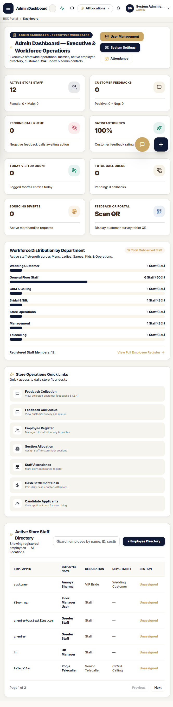
*Figure — Admin Dashboard: quick actions, metric cards, Workforce Distribution, Store Operations Quick Links and the staff directory table.*

**Route:** `/dashboard` (also reachable as `/dashboard?view=hr`, `?view=manager`). Admins and Super Admins see a segmented switcher — **Admin | HR | Manager** — that changes the banner and metric emphasis; other roles land on their fixed view.

Banners: "Admin Dashboard — Executive & Workforce Operations" (Executive storewide operational metrics…), "HR Dashboard — Talent Acquisition & Employee Operations", "Manager Dashboard — Store Floor & Service Operations", greeter: "Entrance Greeter & Visitor Operations Hub".

**Quick actions per view:** Admin → User Management, System Settings, Attendance · HR → Candidate CRM, Wedding Operations, Mark Attendance · Manager → Daily MCheck, Hourly Footfall, Feedback Queue · Greeter → Greeter Kiosk, Hourly Footfall, Feedback QR.

**Metric cards** (all figures computed by the store-operations and employee APIs, scoped to the active location): "Active Store Staff" (with `Female: n • Male: n`), "Customer Feedbacks" (`Positive • Neg`), "Pending Call Queue" (negative-feedback calls awaiting action), "Satisfaction NPS" (`{n}%`), "Today Visitor Count", "Total Call Queue", "Sourcing Diverts" (active merchandise requests), "Feedback QR Portal" (Scan QR).

**Panels:** "Workforce Distribution by Department" (bar list, "{n} Staff ({pct}%)", link "View Full Employee Register") · "Store Operations Quick Links" (Feedback Collection, Feedback Call Queue, Employee Register, Section Allocation, Staff Attendance, Cash Settlement Desk, Candidate Applicants) · greeters instead see "Greeter Visitor Management Desks" (8 tiles including VM Checklist Audit and Live TV Monitor Screen) · "Active Store Staff Directory" table — Emp/App ID · Employee Name · Designation · Department · Section · Joining Date · Status — with search "Search employee by name, ID, section…", pagination (6/page) and row-click to open the employee profile modal.

Greeter-role users who reach this page are redirected to `/footfall` — their working home is the greeter kiosk flow (the greeter dashboard view is served inside this same page for the roles above).

## 18. Where Every Metric Comes From

| You see | It is calculated from |
|---|---|
| Wedding KPI cards (§20) | `wedding_customers` + `wedding_call_logs` rows for the selected location/date filters |
| Telecaller performance (§20/§28) | call logs grouped by telecaller; "won" = customers whose status reached Won/Converted |
| Conversion funnel (§20/§27) | customer counts per pipeline stage |
| Total Scans / Feedback / Conversion (§35) | `FeedbackQrScan` and `Feedback` rows; conversion = feedbacks ÷ scans |
| Satisfaction NPS / CSAT (§16, §37) | q5 recommendation and q1 satisfaction answers |
| Active Store Staff etc. (§16) | `users`/`employees` joined to departments |
| Today Visitor Count (§16) | `FootfallEntries` for the day, across hours |
| Pending Calls / SLA pills (§38) | `CallQueue` age since submission vs 2 h / 24 h thresholds |

No number is typed in by hand — every metric is derived, which is why dashboards change instantly when the location is switched (§9).

---

# PART IV — WEDDING CRM

*Inner tab bar on every wedding page: Dashboard · Customer Register · Add Customer · Telecaller Desk · Call History · Calendar · Status Board · Reports · Import.*

## 19. Wedding CRM Overview and Status Vocabulary

A wedding lead is one **customer record** per person-per-mobile-per-store. It moves through statuses as the telecaller works it, and every call, status change, note, visit, appointment and purchase is attached to it.

**Customer statuses as shown in the UI** (13):
`New Lead · Contact Pending · Contacted · Follow-up Scheduled · Callback · Shopping Planned · Shopping Confirmed · Visit Scheduled · Visited · Won · Not Interested · Lost · Invalid Number`

**Call outcomes a telecaller can log** (11):
`Connected · No Answer · Busy · Switched Off · Wrong Number · Callback Requested · Shopping Confirmed · Visit Planned · Visited · Won · Not Interested`

Badge colors follow meaning: Won/Visited green, Confirmed/Planned blue, Scheduled/Follow-up/Callback champagne, Pending/New slate, Not interested/Lost/Invalid rose.

Terminal statuses (`Converted/Won, Visited, Not Interested, Cancelled, Closed` internally) drop out of the calling queues automatically — a "Won" customer no longer appears in a telecaller's Today/Overdue lists.

**Registration IDs** are system-generated and unique: `BSC-WED-{LOC}-{YEAR}-{000001}` (e.g. `BSC-WED-DAV-2026-000142`). The public wizard issues a separate tracking ID format (Appendix B).

## 20. Wedding CRM Dashboard

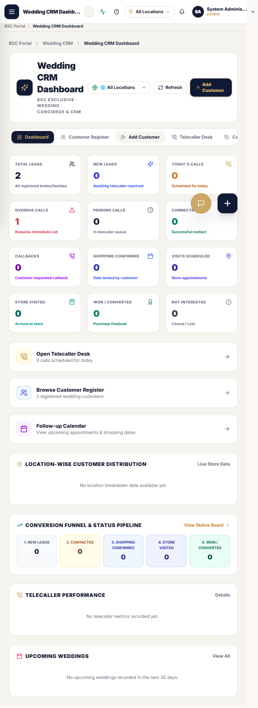
*Figure — Wedding CRM Dashboard with the 12 KPI cards, Quick Ops strip, funnel and performance panels.*

**Route:** `/wedding-crm/dashboard` · **Who:** CRM-capable roles · Header actions: location filter, **Refresh**, **Add Customer**.

**12 KPI cards** (scoped to location; refreshed live):

| Card | Subtitle | Counts |
|---|---|---|
| Total Leads | All registered brides/families | all customers |
| New Leads | Awaiting telecaller reachout | created today / new status |
| Today's Calls | Scheduled for today | follow_up_date = today |
| Overdue Calls | Requires immediate call | follow_up_date < today, still open |
| Pending Calls | In telecaller queue | call_status Pending |
| Connected | Successful contact | Connected/Completed calls |
| Callbacks | Customer requested callback | Call Back Requested |
| Shopping Confirmed | Date locked by customer | status Shopping Confirmed |
| Visits Scheduled | Store appointments | Visit Scheduled |
| Store Visited | Arrived at store | Visited |
| Won / Converted | Purchase finalized | Won |
| Not Interested | Closed / Lost | Not Interested |

**Quick Ops strip:** "Open Telecaller Desk ({n} calls scheduled for today)", "Browse Customer Register ({n} registered wedding customers)", "Follow-up Calendar".

**Panels:** "Location-wise Customer Distribution" (per store: leads / Confirmed / Visited-Won; empty: "No location breakdown data available yet.") · "Conversion Funnel & Status Pipeline" (1 New Leads → 2 Contacted → 3 Shopping Confirmed → 4 Store Visited → 5 Won/Converted; link "View Status Board") · "Telecaller Performance" leaderboard ("{calls} calls / {won} won"; empty: "No telecaller metrics recorded yet.") · "Upcoming Weddings" (next 30 days, top 5, 💍 dates + status pills; empty: "No upcoming weddings recorded in the next 30 days."). Load failure toast: `'Error loading wedding CRM dashboard: …'`.

## 21. Customer Register (List, Search, Filter, Export)

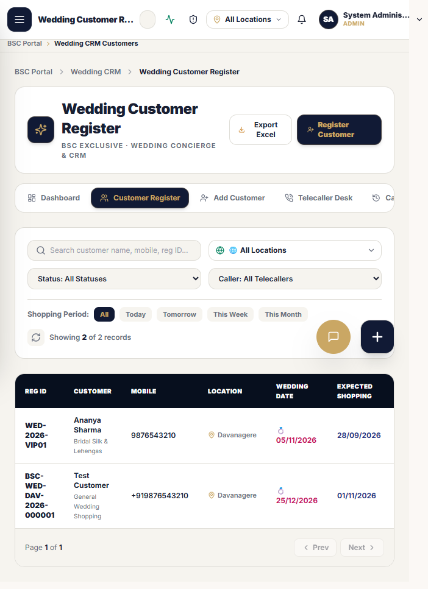
*Figure — Customer Register: filters, shopping-period pills and the row actions (view / log call / WhatsApp / assign / delete).*

**Route:** `/wedding-crm/customers` · the operational worklist.

- **Search:** *"Search customer name, mobile, reg ID…"*
- **Filters:** location select · **Status:** (All + the 13) · **Caller:** (All Telecallers / named) · **Shopping Period pills:** `all | today | tomorrow | this week | this month` · reload button. Counter: "Showing N of M records".
- **Table:** Reg ID · Customer · Mobile · Location · Wedding Date · Expected Shopping · Telecaller · Status · Next Follow-up (overdue rows flagged red **"Overdue"**) · Actions. Reg ID/Customer open the profile.
- **Row actions:** View profile (eye) · Log Call (phone) · **WhatsApp** (opens `wa.me` prefilled *"Namaste {name}, greetings from BSC Exclusive Textiles!"*) · Assign telecaller · Delete.
- **Header:** **Export Excel** (writes `BSC_Wedding_Customers_YYYY-MM-DD.xlsx`, 14 columns incl. Registration ID, Assigned Telecaller, Total Calls) and **Register Customer**.
- Pagination 15/page. Empty state: "No customers match your criteria — Try resetting your filters or search keywords."
- **Delete modal:** "Delete Wedding Customer — This action will archive the customer record." shows Name/Registration ID/Mobile/Store; Confirm Delete → `Customer "{name}" deleted successfully.` **The record is archived (soft delete), never destroyed** — it disappears from lists but remains for audit.

**Log Call modal (from the row phone icon):** "Log Call: {name}" — Call Outcome* (11), Next Follow-up Date, Expected Shopping Date (Updated), Customer Feedback/Notes. Save Call Outcome → `'Call logged successfully'`.
**Assign Telecaller modal:** telecaller cards (name, employee id, role, location; empty: "No telecallers available. Please ensure active telecaller accounts exist in User Management.") → toasts `'Telecaller assigned to {name} successfully.'` / `'Telecaller reassigned to {name} successfully.'` / `'Unable to assign telecaller. Please try again.'`

## 22. New Wedding Customer Registration (Form, Field by Field)

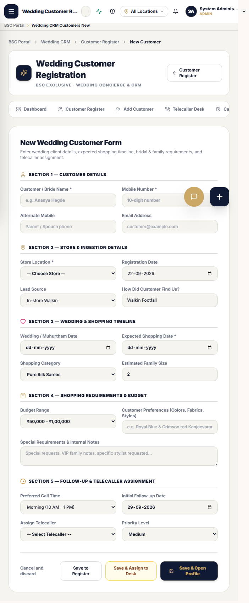
*Figure — the five-section registration form with the three save buttons.*

**Route:** `/wedding/customer-registration` (also `/wedding-crm/customers/new`) · "New Wedding Customer Form — Enter wedding client details, expected shopping timeline, bridal & family requirements, and telecaller assignment."

### Section 1 — Customer Details
| Field | Rule |
|---|---|
| Customer / Bride Name * | required (`'Customer Name is required'`) |
| Mobile Number * | digits only, max 10 (`'Valid 10-digit mobile number is required'`) |
| — Live duplicate check | on the 10th digit the system checks existing records ("Checking existing records…"). A match shows an amber panel **"Existing customer found with this mobile number!"** (code/name/store/status) with two options: **"Link New Wedding Request to this Customer"** (→ "Linked to Existing Customer ✓", toast `'New wedding will be linked to this customer account.'`) or "View Existing Customer" |
| Alternate Mobile | optional, 10 digits, "Parent / Spouse phone" |
| Email | optional; `'Please enter a valid email address (e.g. name@example.com)'` |

### Section 2 — Store & Ingestion
Store Location * (auto-set to your session store; only global admins may change — `'Store Location is required'`) · Registration Date (defaults today) · Lead Source (In-store Walkin / Referral by Friend/Family / Social Media (Instagram/FB) / Wedding Fair / Exhibition / Phone Inquiry) · "How Did Customer Find Us?" free text.

### Section 3 — Wedding & Shopping Timeline
Wedding / Muhurtham Date · **Expected Shopping Date \*** · Shopping Category (Pure Silk Sarees, Bridal Lehengas, Sherwanis & Suits, Family Matching Sets, Fancy & Designer Sarees, Kids Ethnic Wear, Shirting & Suiting, Accessories & Dhotis, General Wedding Shopping) · Estimated Family Size (1–100).

### Section 4 — Requirements & Budget
Budget Range (Below ₹25,000 … Above ₹5,00,000, plus "Not Decided" — 7 options) · Customer Preferences (colors/fabrics/styles free text) · Special Requirements & Internal Notes (stored **encrypted**).

### Section 5 — Follow-up & Telecaller Assignment
Preferred Call Time (Morning (10 AM - 1 PM) / Afternoon (1 PM - 4 PM) / Evening (4 PM - 7 PM) / Night (7 PM - 9 PM) / Any Time) · Initial Follow-up Date (defaults today + 7) · Assign Telecaller (picks from active telecaller accounts) · Priority (Low / Medium / High / Urgent / VIP).

### Save
Three buttons: **Save to Register** (→ list) · **Save & Assign to Desk** (→ telecaller queue) · **Save & Open Profile** (→ new record). Success: `Customer "{name}" created successfully.` Failure: `'Unable to register customer. {reason}'`. "Cancel and discard" clears without saving.

**Database effect:** one `wedding_customers` row (new Reg ID, status New, call status Pending, notes encrypted) + one CRM audit entry "Customer Created". A hard duplicate that slips the client check is refused with HTTP 409 and the message: *"A customer with mobile {x} already exists ({name} — {code}). To create a new wedding registration for this customer, please use the 'Link New Wedding Request' option."*

## 23. Customer 360 Profile

**Route:** `/wedding-crm/customers/{id}` (from any Reg ID link) · header buttons: Back · **Log Call** · **WhatsApp** · **Reassign Telecaller** · **Update Status**.

Profile card: "Reg ID: {code} · 📱 mobile · 📍 store · Telecaller: {name or Unassigned}" and Wedding Date with a live **"Days Left"** chip.

**Tabs:** Call History ({n}) · Notes & Preferences · Status Audit History · All Registrations ({n}).
**Information blocks:** Customer Details (Full Name, Mobile, Email, Store Location, Lead Source, Registration Date) · Wedding & Shopping Information (Wedding Date, Expected Shopping, Category, Budget Range, Family Size) · Follow-up & Telecaller Desk (Assigned Telecaller, Next Follow-up Date, Preferred Call Time, Total Calls Made, Last Call Outcome).

- **Call History:** one card per logged call — outcome, telecaller, remarks, next follow-up; empty: "No call logs recorded for this customer yet. Click 'Log Call' to record the first contact."
- **Notes:** add-note box *"Add a new customer requirement, preference (e.g. Kanjeevaram pure silk, budget notes)…"* → `Customer note added successfully.` (each entry stamped "Registration Note" + author/time).
- **Status History:** every transition, "Changed to {status}" with reason and actor.
- **Update Customer Status modal:** status + reason ("Why is the status transitioning?") → `'Customer status updated successfully.'`
- **Log Call modal:** outcome*, call time (placeholder "e.g. 11 AM"), notes ("Notes from customer call...") → `'Call activity saved successfully.'`
- Missing/other-store record → "Customer Not Found". Telecallers opening a customer *not assigned to them* are refused server-side: *"Access denied: Customer is not assigned to your calling queue"*.
- Managers can additionally record **visits, appointments and purchases** on this profile (each a dated row with notes; "Visit recorded", "Appointment created", "Purchase recorded"), and **merge duplicates** (`Customers merged successfully` — the duplicate is archived into the primary and every call/note is preserved).

## 24. Telecaller Desk

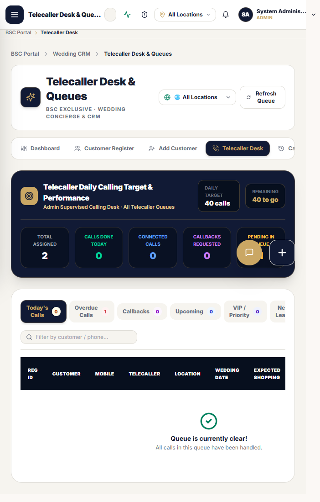
*Figure — Telecaller Desk: daily target strip, queue tabs with live counts and the per-row Call / WhatsApp / Confirm / Won actions.*

**Route:** `/telecaller/desk` (also `/telecaller-dashboard`) · the telecaller's daily command center; also opened by Admins for supervision (then titled "Admin Supervised Calling Desk · All Telecaller Queues" instead of "{Your name} · Live Telephony Queue").

- **Daily target strip:** "Telecaller Daily Calling Target & Performance" — fixed target **40 calls/day**, "Remaining: {n} to go", live pills: Total Assigned · Calls Done Today · Connected Calls · Callbacks Requested · Pending in Queue.
- **Queue tabs (live counts):** Today's Calls · Overdue Calls · Callbacks · Upcoming · VIP / Priority · New Leads · My Queue. The queue auto-refreshes about every 45–50 s (pauses when the tab is hidden).
- **Search** "Filter by customer / phone..." · **Refresh Queue** · location filter.
- **Table:** Reg ID · Customer · Mobile · Telecaller · Location · Wedding Date · Expected Shopping · Status · Next Follow-up · Actions — per-row **Call** (opens the Log Call form), **WhatsApp** (prefilled greeting), **Mark Shopping Confirmed ✓**, **Mark Won 🏅**, View profile. Quick status actions confirm: `Customer status updated successfully to "{status}".`
- Empty queue: "Queue is clear! — All calls in this queue have been handled."
- **Log Call form (call-focused layout):** Call Outcome* (choosing it **suggests the next customer status**: Connected→Contacted, Callback Requested→Callback, Shopping Confirmed→Shopping Confirmed, Visited→Visited, Won→Won, Not Interested→Not Interested) · Update Customer Status (all 13) · Next Follow-up Date · Preferred Call Window · Expected Shopping Date (Updated from call) · **Call Notes & Customer Response \*** ("Enter customer response, family shopping schedule, saree/fabric preferences, budget discussed..."). Note on the form: "Will create a call audit record under your profile." Button **Save & Log Outcome** → `'Call activity saved successfully.'`
- New registrations reach the desk instantly: a record created (by anyone) with today's/overdue follow-up date and status New appears under **New Leads**; assigning a telecaller moves it into **My Queue**.

## 25. Call Logging and Automatic Status Transitions

Every "Save & Log Outcome": inserts a call-log row (encrypted remarks, outcome, timestamp, your name) → increments the customer's Total Calls · sets Last Call Date/Outcome · updates follow-up date, preferred call time and (optionally) the expected shopping date → applies the automatic customer-status transition for the outcome (e.g. Wrong Number closes the customer as Cancelled/Invalid; Shopping Confirmed locks the date) → writes "Call Logged" to the CRM audit trail → dashboards and the Admin's performance board reflect it immediately.

Callback requests **must** carry a next follow-up date and time: *"Next follow-up date is required when outcome is Call Back Requested"*.

## 26. Follow-up Calendar

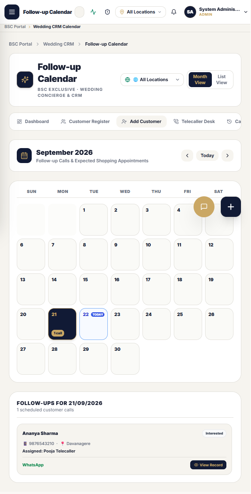
*Figure — month grid with per-day call counts and the day panel listing scheduled customers.*

**Route:** `/wedding-crm/calendar` — "Follow-up Calls & Expected Shopping Appointments". Month/List toggle; ‹ prev / **Today** / next ›. Day cells show "{n} call(s)"; today is chipped. Right panel "Follow-ups for {date}" / "{n} scheduled customer calls"; each customer card: name (→profile), status pill, 📱 mobile · 📍 store, "Assigned: {telecaller}", "Window: {preferred call time}", **WhatsApp**, **View Record**. Empty: "No follow-ups for this date — Select another date…". Reads the same follow-up dates the telecaller desk uses, so the two views always agree.

## 27. Status Board (Pipeline / Kanban)

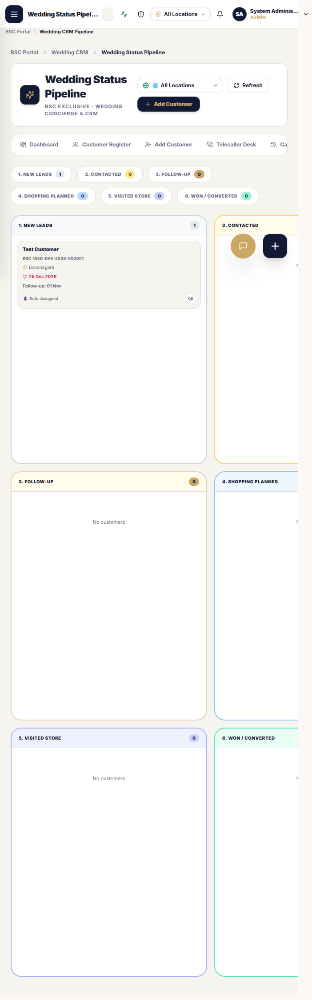
*Figure — the six-column pipeline with customer cards, follow-up chips and priority stars.*

**Route:** `/wedding-crm/pipeline` (alias `/wedding-crm/status-board`) — drag-free visual board of up to 500 open customers per location, in 6 columns:

1. **New Leads** (New / Contact Pending) · 2. **Contacted** · 3. **Follow-up** (Follow-up Scheduled / Callback) · 4. **Shopping Planned** (Shopping Planned / Confirmed / Visit Scheduled) · 5. **Visited Store** · 6. **Won / Converted**.

Cards: name (→ profile), Reg code, 📍 location, 💍 wedding date, follow-up chip prefixed "Overdue:" / "Today:" / "Follow-up:", "👤 {telecaller|Unassigned}", ⭐ for high priority. Header shows summary chips + **Refresh** + **Add Customer**. Empty column: "No customers".

## 28. Call History, Reports and Exports

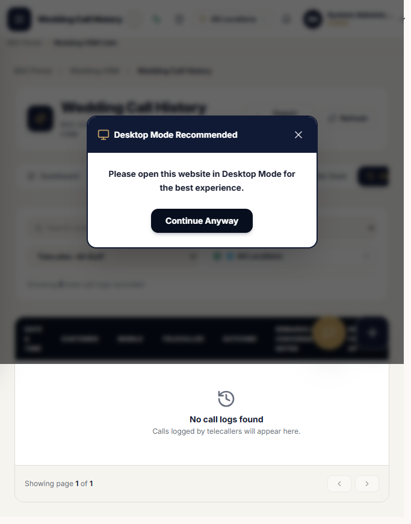
*Figure — Call History log with outcome/telecaller filters and Excel export.*

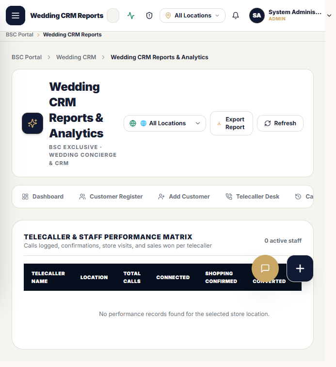
*Figure — Telecaller & Staff Performance Matrix with conversion-rate pills.*

- **Call History** (`/wedding-crm/calls`): searchable ("Search customer, mobile, remarks..."), filter by **Outcome** and **Telecaller** and location; counter "Showing N total call logs recorded". Columns: Date & Time · Customer · Mobile · Telecaller · Outcome · Remarks/Conversation Notes · Next Follow-up · View. **Export Logs** → `BSC_Wedding_Call_Logs_YYYY-MM-DD.xlsx` (`'Call history exported to Excel'` / `'No call logs to export'`). Empty: "No call logs found — Calls logged by telecallers will appear here." Pagination 20/page.
- **Reports** (`/wedding-crm/reports`): "Wedding CRM Reports & Analytics" with location filter; table "Telecaller & Staff Performance Matrix — Calls logged, confirmations, store visits, and sales won per telecaller" ({n} active staff): Telecaller Name · Location · Total Calls · Connected · Shopping Confirmed · Won / Converted · Conversion Rate (% pill). **Export Report** → `BSC_Wedding_Performance_Report_…xlsx`. Empty: "No performance records found for the selected store location."
- Server-side report feeds also exist for overview / per-location / follow-up report types, and customers/call logs can be exported through the export API.

## 29. Bulk CSV Import

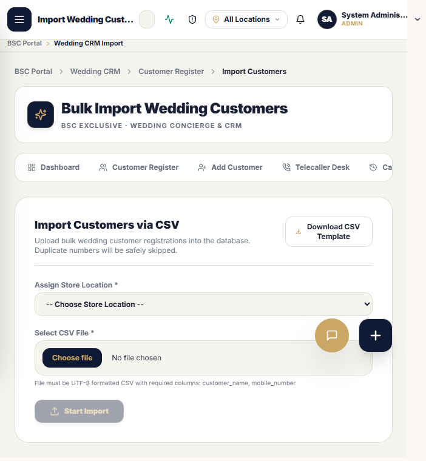
*Figure — bulk import: template download, store assignment and file picker.*

**Route:** `/wedding-crm/import` — "Bulk Import Wedding Customers — Upload bulk wedding customer registrations into the database. Duplicate numbers will be safely skipped."

1. **Download CSV Template** → `BSC_Wedding_Customers_Template.csv` with the exact headers: `customer_name, mobile_number, wedding_date, expected_shopping_date, preferred_shopping_category, estimated_family_size, budget, assigned_telecaller, customer_notes` (`'Sample CSV template downloaded'`).
2. Choose **Assign Store Location \*** (locked unless global admin) and the **CSV file \*** (only `.csv`; `'Please choose a .csv file to import'`, `'Please select a store location'`).
3. **Start Import** ("Processing File...").

Rules enforced per row: name required; mobile must be a valid 10-digit Indian number; expected shopping date required and parseable (YYYY-MM-DD or DD/MM/YYYY; out-of-range rows are skipped); duplicates *within the file and already in the store* are skipped, never overwritten; header-only files are rejected ("The CSV file has no data rows (a header row is required)"). Importing anything but a `.csv` is refused: *"Only .csv files are allowed"*. Nothing larger than 2 MB is accepted, and files never touch the disk (in-memory parse).

Result panel: **"Import Completed — Inserted: {n} customers / Duplicates Skipped: {n}"** with link "View imported records in Customer Register →". Toasts: `'Wedding customers imported and saved successfully.'` / `'Unable to import customers: {reason}'`. Imported rows enter as New / Pending and a single "CSV Import" audit entry records the counts.

## 30. Public Wedding Registration Portal (Customer-Facing)

**Route:** `/wedding-registration` (linked from the login screen and store kiosks — no login needed). Wizard title "BSC Wedding Registration", badge "Official Wedding Portal". Eight steps:

1. **Select Your BSC Store Location** (BEL/DAV/SHI cards)
2. **Customer Personal Details** — name "as per Aadhaar", 10-digit mobile, alternate mobile (optional), email (optional)
3. **Wedding Details** — wedding date, functions
4. **Bride & Groom Details** — names, ages
5. **Wedding Shopping Requirements** — categories, expected visitors, budget
6. **Preferred Visit & Follow-up** — preferred date/time; referral section ("Your BSC emp ID", "Store where you previously shopped")
7. **Additional Requirements**
8. **Consent → Review & Submit** — consent is **mandatory**: *"You must provide consent before submitting."*

Client/server validation mirrors §22 plus future-date rules for wedding/shopping dates (`'A valid future wedding date is required.'`, `'Please enter a valid 10-digit Indian mobile number.'`). Guards: `'Please fill all required fields correctly'`, `'Please fix the errors before submitting'`.

On submit: a `wedding_registrations` row **and** the linked CRM customer are created in one transaction; a confirmation email is attempted (its failure never loses the registration). Success screen shows the **Registration ID** (tap to copy: `'Registration ID copied to clipboard!'`) and tracking ID. Duplicates: `'A registration with this mobile number already exists at this store. Please contact the store directly.'` (server: 409 with the existing record's ID and an offer to register a *new wedding under the same customer*). New registrations appear in the store's telecaller queue as **New Leads** immediately.

## 31. Track Wedding Request (Public)

**Route:** `/track` — "BSC Wedding Tracking". Enter **Wedding Request ID** (placeholder `e.g. BSC-WED-DAV-2026-000001`) + the registered 10-digit mobile. Validation: `'Please enter your Wedding Request ID and registered mobile number.'`, `'Please enter a valid 10-digit Indian mobile number'`. Abuse-limited: 30 lookups per 15 minutes → `'Too many tracking attempts. Please try again later.'` Results: "Registration Not Found" / the request card with a **customer-friendly public timeline** — Registration Received → Contacted → Follow-up Scheduled → Shopping Date Confirmed → Visit Scheduled → Visit Completed → Purchase Processing → Purchase Completed (or Cancelled) — which is translated from the internal statuses; internal notes are never shown.

## 32. Store Landing Page Enquiries

Each store has a public landing page (API `/api/landing`). A visitor submits an enquiry: full name, valid 10-digit mobile, email, store, wedding date, expected shopping date, notes (≤600 chars). Success: **"Your enquiry is registered — your Customer ID has been generated"**. Repeat enquiry: *"You are already registered with our {Store} desk (Customer ID {code}). Our team will call you — or walk into the store quoting this ID."* Enquiries become CRM customers assigned to **"Landing Desk"** with follow-up tomorrow, plus an audit entry "Landing Enquiry". Rate limits protect the form (10 enquiries / 15 min / device). Anonymous page-beacon events ("event") are recorded for store analytics.

## 33. Wedding Operations Desk

**Route:** `/wedding-operations` (key `wedding_operations`; `/offer-process` also lands here). The floor-side companion: shows wedding customers/registrations with their **operations status** — appointments, store visits and purchase processing — so Floor Managers and the Wedding Collection Manager can track confirmed shopping visits through to the sale without leaving the operations view.

<!-- PART5 -->

---

# PART V — FEEDBACK AND QR

## 34. Feedback QR Code Management

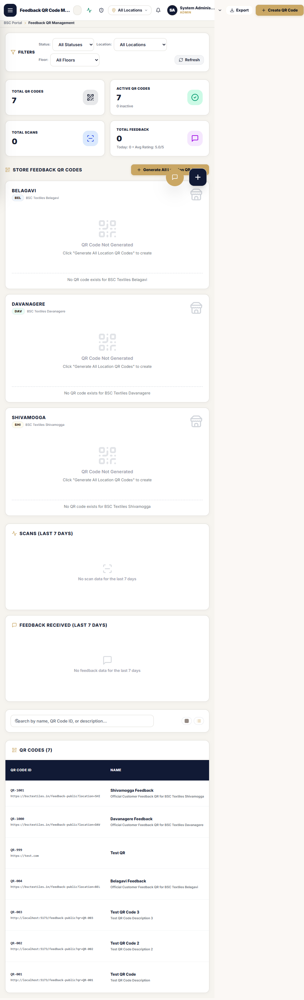
*Figure — QR management: KPI cards, 7-day scan/feedback charts, filters and the per-store QR cards.*

**Route:** `/feedback-qr-management` (key `feedback_qr`; Admin/HR/Manager create, Admin/Super Admin delete). Header: "Feedback QR Code Management — Create, manage, and track customer feedback QR codes across all locations". Buttons: **Export** (CSV `feedback_qr_codes_{date}.csv` — columns QR Code ID, Name, Description, Location, Section, Floor, Status, Scan Count, Feedback Count, Last Scanned, Created At, Created By) and **Create QR Code**.

- **Filters:** Status (All/Active/Inactive/Archived) · Location · **Floor** (Ground/First/Second/Third/Fourth/Basement/Mezzanine) · Refresh; search "Search by name, QR Code ID, or description…"; sortable columns; 20/page.
- **KPI cards:** Total QR Codes · Active QR Codes ("{n} inactive") · Total Scans · Total Feedback ("Today: {n} • Avg Rating: {x}/5").
- **Charts:** "Scans (Last 7 Days)" and "Feedback Received (Last 7 Days)" (empty: "No scan data for the last 7 days").
- **Store QR cards** section with one-tap **"Generate All Location QR Codes"**: each store card (BEL blue / DAV emerald / SHI amber) shows the QR image, the public feedback URL, Scans/Feedback/Converted stats and Copy / Open / PNG / SVG buttons. Missing card state: "QR Code Not Generated — Click 'Generate All Location QR Codes' to create".
- **Create/Edit QR modal:** Name* ("e.g. Main Entrance Feedback, Billing Counter QR"), Description, Location* (code & name auto-sync; mismatches are refused server-side: *"Location code mismatch. Please re-select the location."*), Floor (or custom), Section, Feedback Form (survey template), Status (active/inactive/archived). Success: `QR code generated successfully.` / `QR code updated successfully.`; `{LocationName} QR Code created successfully` on the server side.
- **Row actions:** edit · **status toggle** (`QR code activated/deactivated successfully`) · **regenerate** image (`QR code regenerated successfully`) · **delete** with browser confirm (`Delete QR Code "{name}" ({id})? This action cannot be undone.`) — deletion is an **archive** (`deletedAt` + status archived; Admin/Super Admin only).
- **Scan history modal:** per-QR list of scans (when / device / IP); "No Scans Recorded" when none.

Location QRs use reserved IDs **QR-BEL / QR-DAV / QR-SHI**; manually created codes are numbered QR-001, QR-002…

## 35. QR Display Screen and Scan Tracking

**Route:** `/feedback-qr` — the display page meant for POS counters and tablets: "Location-Based Feedback QR Codes — POS & Customer Checkout QR Displays". Filter pills (All Locations (3) / each store), stats strip (Total Scans · Feedbacks Logged · Converted Scans), and per-store cards: QR image ("Scan with any smartphone camera"), "Public Feedback Destination" box, Scans/Feedbacks/Conversion counters, and **Copy URL** (`{Store} feedback link copied successfully.`), **Open Page**, **Download PNG**, **Download SVG**. "Sync QR Codes" re-provisions the three store QRs (`'All 3 location-based QR codes refreshed successfully.'`).

**How scanning works:** every scan of a QR (a customer opening the survey) is recorded server-side with time, IP, device type, browser, OS and referrer; the QR's scan counter and last-scanned time increase. If the customer completes the survey, that scan is marked "feedback submitted" and linked to the feedback — this pairing produces the **Conversion %** you see.

## 36. Public Customer Feedback Survey (QR Target)

**Route:** `/feedback-public?location=BEL|DAV|SHI` (the QR target). No login. Kiosk-style survey: "{Store} • STORE SURVEY — **Customer Experience Survey** — Help us improve your shopping experience in just one minute." A live progress ring shows % done; step tracker: Details · Shopping · Product · Staff · Recommendation · Feedback; "Est. Time: 1 Min", "5 Survey Sections".

1. **Customer Verification Details** (*Required): Full Name*, Mobile Number* (+91, 10 digits) — *"We will only use this number for service follow-up."*
2. **Five questions** (server-managed; may be updated by Admins):
   - q1 *How satisfied are you with your overall shopping experience today?* — Very satisfied / Satisfied / Neutral / Dissatisfied / Very dissatisfied
   - q2 *Did you find the product you were looking for?* — Yes, exactly what I wanted / Yes, with assistance / Partially / No
   - q3 *How would you rate the quality & variety of our collection?* — Excellent / Good / Average / Poor
   - q4 *How would you rate the behavior and helpfulness of our staff?* — Extremely helpful / Helpful / Average / Poor
   - q5 *How likely are you to recommend BSC Exclusive to your friends and family?* — Definitely recommend / Probably recommend / Neutral / Not recommend
3. **Voice of Customer Notes (Optional):** "What did you like most…", "What can we improve…", "Any additional comments…".

**Submit Feedback Response** → success screen: "Thank You! Your valuable feedback has been received successfully…" with a **Survey Reference ID** (FB-…) and "Submit Another Survey Response". Toast: `{Store} feedback submitted successfully.` / `'Unable to submit feedback. Please try again.'`

**Automatic escalation:** any Dissatisfied/No/Poor/Not-recommend answer (or complaint words such as "rude", "refund") flags the feedback negative, instantly creates a **Call Queue** entry, and live-alerts open dashboards: "ALERT: Negative customer feedback logged by {name} ({mobile})."

## 37. Feedback Collection and Resolution Workspace

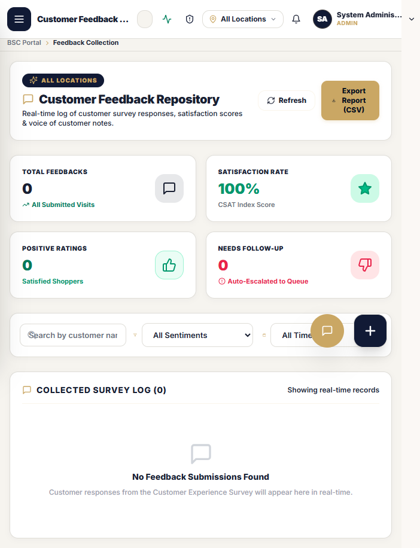
*Figure — feedback repository with CSAT KPIs, sentiment filters and the ticket/resolution actions.*

**Route:** `/feedback-collection` (key `feedback_collection`) — "Customer Feedback Collection & Analytics → Customer Feedback Repository". Auto-refreshes every 5 s; location-aware.

- **KPIs:** Total Feedbacks ("All Submitted Visits") · Satisfaction Rate (`{n}%` CSAT Index Score) · Positive Ratings ("Satisfied Shoppers") · Needs Follow-up ("Auto-Escalated to Queue").
- **Filters:** search (name/mobile/text) · Sentiment (All/Positive/Satisfied/Negative/Needs Follow-up) · date presets (All Time/Today/Yesterday/This Week/This Month/Last Month/Custom).
- **Table "Collected Survey Log ({n})":** Date & Time · Customer Details · Overall Experience (q1 chip) · Product Found (q2) · Sentiment badge ("Resolved & Closed" / "Escalated to Manager" / "In Progress" / "Auto-Escalated (New)" / "Satisfied") · Voice of Customer · Actions (View Ticket, delete).
- **Ticket modal:** ID `#FB-{n}`, priority pill, escalation notice ("Escalated to Telecaller Call Queue … Status: Pending Follow-up"), satisfaction summary, all five answers, the three voice-of-customer notes, and a **Customer Journey Escalation Timeline** (QR Submitted → Feedback Recorded → Call Queue Added/Survey Completed → Closed).
- **Resolution Workspace:** Follow-Up Action Status select — *"Called - Follow Up Needed" / "Resolved - Customer Satisfied" / "Escalated to Store Manager"*; read-only "Assigned Executive / Priority" ("Telecaller Team (High Priority)" / "Floor Manager (Normal Priority)"); Internal Resolution Notes. Buttons: **Mark In Progress** · **Escalate to Store Manager** · **Mark Resolved** · **Save Resolution Notes** (`'Customer resolution status updated and saved!'`) · Delete Ticket.
- **Export Report (CSV)** → `BSC_Customer_Feedbacks_{date}.csv` (`'Exported feedback data to CSV'` / `'No feedback records to export'`).
- **Clear All Feedbacks** (danger): confirms *"Are you sure you want to permanently delete ALL feedback details {for this location | across all locations}? This cannot be undone."* → `'All feedback details cleared successfully'`. Use sparingly — this is a hard delete of the survey history.

## 38. Feedback Call Queue Desk

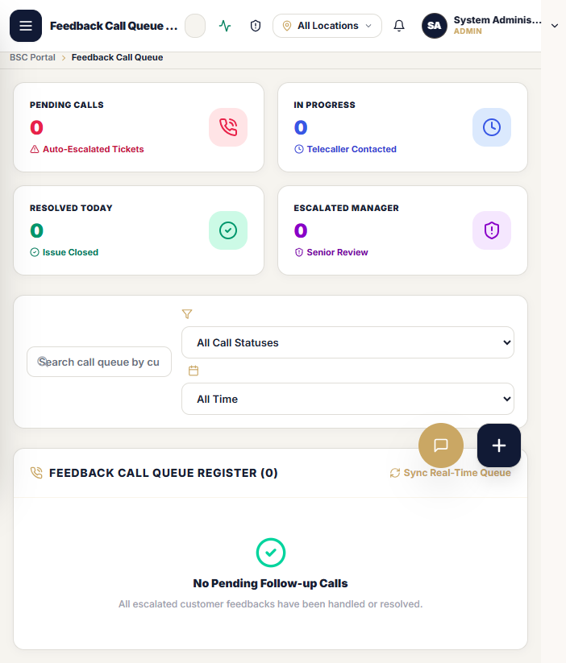
*Figure — call queue with SLA tracking pills, workflow statuses and the Log Structured Call action.*

**Route:** `/feedback-list` (key `feedback_list`) — "Feedback Call Queue Desk — Telecaller Resolution Workspace & Customer Issue Lifecycle Management". Live (Socket.IO) + 5 s refresh.

- **KPIs:** Pending Calls (Auto-Escalated Tickets) · In Progress (Telecaller Contacted) · Resolved Today (Issue Closed) · Escalated Manager (Senior Review).
- **Filters:** search · "All Call Statuses" (Pending/New/In Progress/Called/Resolved/Escalated to Store Manager) · date presets.
- **Register table:** Customer Details · Submission Date & Time · **SLA Tracking** ("🚨 SLA Critical (>24h)" / "⚠️ SLA Warning (>2h)" / "Normal (<2h)") · Call Attempts ("{n} Call Logged") · Workflow Status · Call History/Remarks · Action Desk (**Log Structured Call**). Empty: "No Pending Follow-up Calls — All escalated customer feedbacks have been handled or resolved."
- **Log Telecaller Call Outcome modal:** customer context ("Submission Date … Total Attempts: n"); **Call Outcome \*** (Connected (Spoke with customer) / Not Answered / No Reply / Line Busy / Switched Off / Out of Reach / Call Back Later Requested / Wrong Number / Issue Resolved on Call / Escalated to Store Manager); **Issue Category \*** (Staff Behavior / Courtesy · Product Quality / Fit Issue · Product Out of Stock · Pricing / Billing Concern · Store Environment / AC / Billing Counter · Other General Feedback); Next Follow-Up Date & Time; Resolution & Call Remarks*. Each save appends a formatted entry `[Call #{n} - {time}] Outcome: … | Category: … | Notes: …` (`'Call activity saved successfully.'`). Quick buttons: Escalate Manager / Mark Resolved / Save Log.

**Admin ↔ Telecaller sync:** a queue call updates the feedback ticket status in §37 instantly; the §20/§16 dashboards' "Pending Call Queue" counts drop; when resolved, the ticket badge becomes "Resolved & Closed".

---

# PART VI — STORE OPERATIONS

## 39. Hourly Footfall

**Route:** `/footfall` (key `footfall`; the Greeter's home page). Entrance staff record visitor counts hour by hour for the active store. Each hour slot accepts the visitor figure and saves it ("Footfall slot updated successfully"); today's totals feed the "Today Visitor Count" dashboard cards and regional analytics. Past hours can be corrected by editing the slot.

## 40. VM Checklist (Visual Merchandising Audit)

**Route:** `/vm-checklist` (key `vm_checklist`; VM, Manager, Admin, Greeter-tile access). "Visual Merchandising Checklist — Store Floor Styling & Display Standards Audit Desk".

- **Built-in floors:** Ground Floor ("Main Entrance & Saree Galleria" — Normal Sarees) · First Floor ("High-Value Silk & Luxury Sarees" — Silk Sarees (Upto Lakhs)) · Second Floor ("Ladies Wear and Kids Wear") · Third Floor ("Mens Wear and Home Furnishing"). Admins can **create additional floors** (validation: *"Floor name is required"*, *"Please add at least one section for this floor"*) and delete custom floors; floors/sections are stored per location (`Store floor created successfully` / `Store floor removed successfully`).
- **Audit form:** pick Floor → Section → **Shift** (Opening/…) → answer the **10 standard VM questions** per section, each **Passed / Failed** with optional remarks:
  1. Is the entire section clean, neat, and well-maintained?
  2. Are products arranged according to category, colour, and size?
  3. Are all racks, shelves, tables, and displays properly aligned?
  4. Are new arrivals and the latest collections displayed prominently?
  5. Are mannequins styled according to the current theme?
  6. Are price tags, product labels, and signage correctly placed and visible?
  7. Are promotional and offer displays updated and correctly positioned?
  8. Is the colour blocking and overall visual theme maintained?
  9. Are folded, hanging, and stacked products properly presented?
  10. Does the section meet the daily VM standard and look attractive to customers?
  ("Is the section… attractive?" is the completion criterion; the final question is shown as the daily VM standard.)
- **Submit Audit Report** ("Submitting Report…") → `Visual Merchandising Checklist submitted successfully.` / `'Unable to submit VM checklist: {reason}'` → stored as an inspection with inspector name ("VM Inspector" default for kiosk use), date, per-question results and completion %.
- **History & analytics:** filter by Floor / Section / Status / Inspector / date range / search; per-submission "Overall VM Score" with floor breakdown (Ground/First/Second/Third + Overall); pass/fail chips ("Passed"/"Failed").

## 41. Daily MCheck, MCheck Reports and History

The "Daily Management Checklist & Operational Verification System" — 6 operational modules, 6 checklists, **40 checkpoints** (re-provisioned on server updates; content is owned by Admin).

- **`/daily-mcheck`** (key `daily_mcheck`): the day's audit desk. Checklist-grouped checkpoint cards; each checkpoint moves through statuses **PENDING → IN_PROGRESS → DONE / NOT_DONE / POSTPONED** with notes/photo evidence where prompted; progress ring + KPI row (Total · Done · Pending · Not Done · In Progress · Postponed · **Completion %**). "Checkpoint Configuration" (Admin) tunes per-module settings. Saving writes per-checkpoint responses + an audit entry.
- **`/mcheck-reports`** (key `mcheck_reports`): KPI report over a date range/location — module-wise completion, compliance charts, and **PDF / Excel export** (server-rendered).
- **`/mcheck-history`** (key `mcheck_history`): day-wise list of every completed checklist with statuses, so management can prove what was verified on any past date.

## 42. Sourcing Diverts and Purchase Manager View

- **`/divert`** (key `divert`): store staff raise **sourcing diverts** — merchandise the store needs procured (item, quantity, priority, reason from the seeded DivertReasons list). Creates "Divert created successfully"; high-priority ones alert managers live ("URGENT DIVERT: …"). Each divert carries a status trail (open → …) with updates logged per action.
- **`/pm-view`** (key `pm_view`): the Purchase Manager's worklist of open diverts — accept, progress and close them; every status change appends to the divert's update trail.

## 43. Cash Settlement Desk

**Route:** `/cash-settlement` — the daily POS reconciliation screen, opened behind the **Cash Counter PIN** (§47/§11-Settings): enter PIN → verify (`PIN Verified` / `Invalid PIN`) → enter cash / card / UPI tallies per counter and **Save** ("Cash settlement saved successfully"). Settlements are stored per store per day and feed the Admin dashboard's cash view.

## 44. Greeter Kiosk and Live TV Display

- **`/greeter`** (key `greeter`): entrance desk behind the **Greeter PIN**. Quick visitor entry, launch links to wedding registration, feedback QR display, and the greeter dashboard tiles ("Entrance Greeter & Visitor Operations Hub" — Today Visitor Count, Launch Desk, Display QR).
- **`/tv`** (public route, PIN-gated): full-screen live monitor mode for the store display (announcements/activity), behind the **TV Screen PIN**.

## 45. Attendance & Roster

**Route:** `/attendance` (key `attendance`; `/roster` redirects here). Mark staff attendance (Present/Absent etc. per day), view the monthly roster grid, search per employee, and export the sheet (client-side Excel). Marks feed the dashboard's staff views; HR/Manager/Admin roles maintain; employees see their own.

## 46. Broadcast Center

**Route:** `/broadcast-center` (key `broadcast`). Compose announcements — title, message, priority, target role (or all), pin option. Published broadcasts appear instantly in every targeted user's notification bell ("Notification Center") with unread badges.

## 47. Kiosk PINs and Security Administration

- **Kiosk PINs** (Settings → "Store Kiosk & Cash PINs"): Admin sets the three per-scope PINs — Entrance Greeter Kiosk, Live Store TV Screen, Cash Settlement Desk. The form asks for 4–10 characters, but the server enforces **4–8 numeric digits** (`"{field} must be 4-8 digits"` — use digits only); blank field = unchanged; validations `'Type a new PIN in at least one field first.'` / `'PINs must be 4-10 characters.'`, success `'Store Operational PINs updated (stored securely)!'` **PINs are stored only as bcrypt hashes** — nobody can read them back from the system.
- **System Administration** (`/system-admin`, key `system_admin`): the security console — live session list, **force logout**, **unlock account** (*"Account unlocked successfully"* / *"User ID is required"*), security settings (per `security_settings`), live activity feed, system logs, and clearing the DevTools detection history (*"Developer tools detection history cleared"*).

## 48. Internal Chat

**Route:** `/chat-dashboard` (guard key `dashboard`) plus a floating ChatWidget on every authenticated page — internal staff messaging; messages are stored server-side (`'Message is required'` guard, `"Chat history cleared"` for Admins). Socket.IO delivers in real time.

<!-- PART6 -->

---

# PART VII — TALENT (HRMS MODULES STILL IN SERVICE)

## 49. Candidate CRM

*Figure — Candidate CRM pipeline with KPI header and candidate table.*

**Route:** `/candidates` (key `candidates`; HR/Manager/Recruiter/Interviewer). The hiring pipeline: candidate list with KPI header (totals, pending actions, source breakdown charts), search and status filters, application-number sequence (`APP-…`), per-candidate profile with documents (resume/photo uploads ≤ **800 KB**, formats PDF/DOC/DOCX/JPG/JPEG/PNG — oversized files are refused: *"File exceeds the maximum allowed size of 800 KB."*), activity timeline, interview schedule (Call 1 / Call 2 / Interview steps), panel scoring via one-time interview **tokens** (interviewers open a tokenized score form; `submitInterviewScore` flow), selection/rejection decisions, and offer-desk statuses (Pending Accept → … → Mark Joined). Duplicate phone detection runs at entry (`check-duplicate`). Candidates are location-scoped like everything else. **Note:** the Interview Panel, Onboarding and Exit/FnF full pages are retired (§56) — those flows are handled from the candidate/employee pages or outside the portal.

## 50. Manpower Planning (Openings)

**Route:** `/openings` (key `openings`). Requisitions and open positions per department/designation/section — create, update (`updateOpening`), view counts of applicants and pending actions. The public Job Applicant page (§55) reads open positions so applicants choose a real role.

## 51. Department Hiring Status & Section Allocation

- **`/department-hiring`** (key `dept_hiring`): targets per Department × Section × Designation (required openings vs hiring target vs achieved), remarks editable; visual progress per department.
- **`/section-allocation`** (key `section_allocation`): allocate joined staff to floor sections (single or bulk save — `bulkSaveSectionAllocation`), keeping the floor plan current; feeds the dashboard's Workforce Distribution panel.

## 52. Employee & Store Directory

*Figure — workforce directory with search, location scope and profile modal.*

**Route:** `/employees` (key `employees`; `/greyhr` redirects here). The joined-workforce directory: employee/app ID, name, designation, department, section, branch/location, joining date, status; search + location filters; row click opens the profile modal (personal details, documents, photo edit); Admin/HR/Manager can update records, Admin/HR bulk-add employees, Admin/HR delete. Export supported (client-side Excel). "Active Store Staff" metrics come from here.

## 53. DOJ & Not Joined Desk

**Route:** `/doj-desk` (key `doj_desk`; `/joining-desk` and `/joined-store` redirect here). Tracks selected candidates around their Date of Joining: expected vs actual DOJ, not-joined handling (record reason / release the opening), and the join action that moves a candidate into the employee directory.

## 54. Batch Plan (Weaving Training Batches)

**Route:** `/batch-plan` (key `batch_plan`). Manage training batches per location (status Draft/Active/Completed/Cancelled; default department "Weaving"), each with groups led by a mentor and target counts, and group members (status Assigned → In Progress → Graduated/Dropped). Deleting a batch is Admin-only.

## 55. Job Applicant Registration (Public)

*Figure — public applicant registration form.*

**Route:** `/apply` (alias `/applicants/register`) — public form for walk-in applicants: personal details, qualification, experience, expected salary, designation choice from live openings, duplicate-phone check, resume upload. Creates a candidate row with status New and activity entry; the sidebar link "Job Applicant Registration" opens this in a new tab.

## 56. Retired Modules (Important Note)

These pages are **deliberately disabled** in the current release; their old bookmarks redirect with a note "Disabled pages per user request": **Onboarding**, **Exit & FnF**, **Interview Panel** (→ `/employees` or `/candidates`). Several sidebar names kept for muscle-memory redirect to their live equivalents: `/roster` → Attendance, `/joining-desk` → DOJ Desk, `/greyhr` → Employees, `/regional-analytics` → Dashboard, legacy `?tab=` wedding links → the dedicated wedding routes. Any feature listed in older brochures but not reachable in the menu is **not currently implemented**.

---

# PART VIII — OPERATING PROCEDURES AND REFERENCE

## 57. Search, Filter and Sorting Conventions

- **Search boxes** are "contains" text matches across the fields listed in each page's placeholder (name, mobile, ID…). They filter client-side on most registers; server-side on customer lists.
- **Filter selects** (Status / Role / Location / Telecaller / Floor / Sentiment / date presets) combine with search; "Reset" appears as choosing *All* again or pressing the reload icon.
- **Location filters** on every CRM/store-ops page respect the top-bar branch scope; for global admins they narrow, for store users they are locked.
- **Sorting:** QR Management table columns are click-sortable (▲▼ indicators); most registers default to newest-first or follow-up-date order; pagination is 15/page (customer register), 20 (QR, call history), 6 (staff directory).
- **Global search** (`Ctrl+K`) spans people/customers/pages from anywhere.

## 58. Forms and Validation Rules (system-wide)

| Input | Rule (enforced on server too) | Typical message |
|---|---|---|
| Mobile (India) | 10 digits starting 6–9, optional +91/0 prefix; stored normalized `+91XXXXXXXXXX` | `'Please enter a valid 10-digit Indian mobile number'` |
| Email | standard `name@domain.tld` pattern | `'Please enter a valid email address (e.g. name@example.com)'` |
| Username | 3–100 chars, letters/digits `. _ @ + -` spaces | `'Username must be 3-100 characters and contain only letters, numbers, dots, underscores, or @ symbols'` |
| Password (Admin-created) | ≥ 6 characters | `'Password must be at least 6 characters long'` |
| Password (self-service reset / Admin reset dialog) | ≥ 8 characters | `'Password must be at least 8 characters long'` |
| Full/Company name | 2–150 characters (wedding forms: letters, `.'-`) | `'Customer name is required and must be at least 2 characters.'` |
| Dates | real calendar dates `YYYY-MM-DD`; wedding/expected-shopping dates must be **future** on public forms; CSV accepts DD/MM/YYYY too | `'A valid future wedding date is required.'` |
| Numbers | family/visitors ≤ 1,000; guests ≤ 100,000; ages ≤ 120; budget ranges are fixed options | — |
| Consent (public wizard) | mandatory | `'You must provide consent before submitting.'` |
| Role on user forms | must be a known role | `'Invalid role "{x}".'` |
| Duplicates | mobile+store uniqueness (customers); username, email, employee-ID uniqueness (users) | HTTP 409 messages quoted in §22/§30/§11 |
| File uploads | docs ≤ 800 KB (PDF/DOC/DOCX/JPG/JPEG/PNG); CSV import ≤ 2 MB, `.csv` only | `'File exceeds the maximum allowed size of 800 KB.'` / `'Only .csv files are allowed'` |

Every form failure returns HTTP 400 with the list of problems (`"Validation failed"` + per-field messages) and the toast shows the first; nothing partial is ever saved. SQL-flavoured technical errors are sanitized for users into: *"A record with this information already exists in the system."* / *"Something went wrong while saving the information. Please try again or contact system support."*

## 59. Success and Error Messages Reference (most used)

| Situation | Exact message |
|---|---|
| Customer created | `Customer "{name}" created successfully.` |
| Call saved | `Call activity saved successfully.` |
| Status changed | `Customer status updated successfully.` |
| Telecaller (re)assigned | `Telecaller assigned to {name} successfully.` / `Telecaller reassigned to {name} successfully.` |
| Customer deleted (archived) | `Customer "{name}" deleted successfully.` |
| CSV import done | `Wedding customers imported and saved successfully.` + panel "Import Completed — Inserted/Duplicates Skipped" |
| Public registration | `Wedding registration submitted successfully.` / duplicate notice per §30 |
| Feedback submitted | `{Store} feedback submitted successfully.` → "Thank You!" screen |
| QR created / deleted | `QR code generated successfully.` / `QR code deleted successfully.` |
| User created | `User account "{username}" created successfully` |
| User permissions saved | `Permissions matrix for "{username}" saved successfully` |
| Password reset (admin) | `Password for "{username}" has been reset securely` |
| Visibility saved | `Page visibility saved!` |
| VM audit submitted | `Visual Merchandising Checklist submitted successfully.` |
| Footfall saved | `Footfall slot updated successfully` |
| Divert created | `Divert created successfully` |
| Settlement saved | `Cash settlement saved successfully` |
| Any 401 | *Authentication failed. Please check your credentials.* |
| Any 403 | *Access denied. You do not have permission to perform this action.* (server: `Forbidden: insufficient permissions`) |
| Any 404 | *The requested resource was not found. Please contact your administrator.* |
| Locked 423 | *Account temporarily locked due to too many failed attempts. Please try again later.* |
| Throttled 429 | *Too many requests. Please wait and try again.* |
| Server 500/503 | *Server error. Please try again or contact your administrator.* (production hides internals: `Internal Server Error`) |
| Offline | *Network error. Please check your internet connection and try again.* + banner |

## 60. Database and Data Flow Explained

**The path of one action:** *You press Save → the screen packages your data + your active store → the API re-validates everything, re-checks your login, role, permissions and store → the database writes the business row(s) + an audit entry → the response confirms → the toast and tables update; live dashboards recompute.*

Domain groups of stored data (what the portal keeps, per store):

- **People & access:** accounts (password as a hash only), roles, role-page visibility, per-user module permissions, multi-location assignments, kiosk PIN hashes, consents, session/token revocations.
- **Wedding CRM:** customers (status, call counters, follow-up dates, budget/category/preferences), call logs (outcome, encrypted remarks, next follow-up), visits, appointments, purchases (bill, amounts, payment status), notes, status history (old → new, who, why), communications, documents, CRM audit trail; public registrations (bride/groom/functions/requirements + consent) linked to customers with tracking IDs; landing enquiries/beacons.
- **Feedback & QR:** QR codes (per store/section/floor, image, status, counters), every scan (device/IP/time), survey answers (FB-… references, sentiment flags), escalation call-queue tickets with structured call logs.
- **Store operations:** hourly footfall, daily cash settlements, diverts + reasons + update trail, VM floors/sections + audit submissions per question, MCheck checklists/responses/audit, attendance + roster + shifts, broadcasts.
- **Talent:** candidates (+documents, activities, duplicate flags), interview schedules/tokens/evaluations, selections/rejections, offers, employees directory, designations, openings/requisitions, hiring targets, sections, training batches.
- **Platform:** locations, settings (e.g. the DevTools-shield flag), global audit log (who/action/module/IP/user-agent/location/success), per-API-call session activity, workflow definitions/instances/approvals.

Sensitivities: customer notes, call remarks and communication details are **encrypted at rest** (AES-256-GCM); passwords and kiosk PINs are stored only as one-way hashes; deletes in business modules are archives (soft deletes) so history survives; only feedback "Clear All" and true user deletion remove rows.

## 61. Complete End-to-End Workflows

**Workflow A — New Wedding Customer (counter/phone lead)**
Admin/HR/CRM user opens *Register Wedding Customer* → fills the 5 sections (§22) → live duplicate check links to an existing family if the mobile is known → Save → Reg ID `BSC-WED-DAV-2026-…` issued → appears in Customer Register, Wedding Dashboard "New Leads", and (if assigned/follow-up today) the telecaller's queue → Telecaller calls, logs outcome (§24) → status advances Contacted → Shopping Confirmed (date locked) → Visit Scheduled → store greets; visit recorded on the profile → Won + purchase row after billing → customer leaves all open queues; Reports/leaderboard credit the telecaller.

**Workflow A′ — Public registration variant**
Customer completes the 8-step wizard on their phone (§30) or an enquiry on the landing page (§32) → registration + customer created, tracking ID texted/shown → "New Leads" card count rises on the Admin dashboard within seconds → same follow-up chain as above; customer self-checks progress on /track.

**Workflow B — New Employee**
Admin → *User Management* → Create New User (§11.5): username, temporary password, role, department/designation/section, store(s), initial modules (view-only) → Save → account exists → open the **Access Control Matrix** to add Add/Edit/etc. rights → hand the user their password; they log in (forced consent on first run) and land on the dashboard their role sees. Later: reset password, deactivate on exit, or delete (hard) with confirmation.

**Workflow C — Permission Change**
Admin → User Management → sliders icon for the user → toggle operations per module (or Grant All View / Full Control All / Revoke All) → Save Matrix Permissions → the note is true: the change applies to the user's *current* session immediately (server re-checks on each call; sidebar re-renders). For whole roles: Settings → Page Visibility Matrix → adjust role × page cells → Save Visibility Settings.

**Workflow D — QR Feedback Loop**
Admin → Feedback QR Management → Generate All Location QR Codes (or create a section QR) → print/display at the counter → customer scans → survey (§36) opens prefilled with the store → submit → FB-… stored, scan↔feedback linked (conversion +1) → *negative answers auto-create a Call Queue ticket + live alert* → Telecaller opens Feedback Call Queue, works the SLA list, logs structured calls (§38) → ticket resolved/escalated → Admin reviews in Feedback Collection (CSAT, sentiment filters, CSV export).

**Workflow E — VM Inspection**
VM/Manager opens *VM Checklist* → Floor → Section → Shift → marks each of the 10 questions Passed/Failed (+ remarks) → Submit Audit Report → submission row with Overall VM Score → history filters by floor/inspector/date → Admin spot-checks in the same screen's history panel.

**Workflow F — Daily Management (MCheck) day**
Opening: duty manager opens *MCheck Store Audit*, works checkpoints (DONE/NOT_DONE/POSTPONED with notes) → completion ring rises → mid-day and closing updates → *MCheck History* holds the day → *MCheck Reports* exports the PDF/Excel for regional review. Parallel small loops: Greeter records footfall hourly; Cashier closes the day at *Cash Settlement*; entrance staff publish a *Broadcast* if needed.

## 62. Role Responsibilities and Data Ownership Matrix

| Data / Action | Super Admin / Admin | Manager / Floor Manager | HR | Telecaller (incl. VM Ext.) | CRM Mgr / Exec | VM | Greeter | Team Lead | Recruiter / Interviewer | Data Analyst |
|---|---|---|---|---|---|---|---|---|---|---|
| Create/edit users & permissions | ✅ | ✖ (visibility-gated) | ✖ | ✖ | ✖ | ✖ | ✖ | ✖ | ✖ | ✖ |
| Page visibility, settings, PINs, security console | ✅ | ✖ | ✖ | ✖ | ✖ | ✖ | ✖ | ✖ | ✖ | ✖ |
| Register wedding customer | ✅ | ✅ | ✅ | ✅ | ✅ | ✖ | ✅ (wizard) | ✅ | ✖ | ✖ |
| Work the calling queues / log calls | ✅ (supervise) | ✅ | view | **✅ primary** | ✅ | ✖ | ✖ | view | ✖ | ✖ |
| Change customer status, assign telecaller | ✅ | ✅ | ✖ | ✅ own queue | ✅ | ✖ | ✖ | ✖ | ✖ | ✖ |
| Merge / delete customers, CSV import | ✅ | ✅/HR per endpoint | ✅ | ✖ | ✖ | ✖ | ✖ | ✖ | ✖ | ✖ |
| QR create/toggle/regenerate | ✅ | ✅ | ✅ | ✖ | ✖ | ✖ | view | ✖ | ✖ | ✖ |
| QR delete (hard) | ✅ (Admin only) | ✖ | ✖ | ✖ | ✖ | ✖ | ✖ | ✖ | ✖ | ✖ |
| Feedback resolution tickets | ✅ | ✅ | ✅ | ✅ (queue) | ✖ | ✖ | ✅ view | ✖ | ✖ | ✖ |
| Footfall entry | ✅ | ✅ | ✅ | ✖ | ✅ | ✅ | **✅ primary** | ✖ | ✖ | ✖ |
| VM checklist answer | ✅ | ✅ | view | ✖ | ✖ | **✅ primary** | ✅ (desk) | ✖ | ✖ | ✖ |
| VM floors create/delete, MCheck config | ✅ | partial | ✖ | ✖ | ✖ | ✖ | ✖ | ✖ | ✖ | ✖ |
| MCheck daily audit | ✅ | **✅ primary** | ✅ | ✖ | ✖ | ✅ | ✖ | ✖ | ✖ | ✖ |
| Divert raise | ✅ | ✅ | ✅ | ✖ | ✖ | ✖ | ✖ | ✖ | ✖ | ✖ |
| Divert fulfilment (PM view) | ✅ | ✖ | ✖ | ✖ | ✖ | ✖ | ✖ | ✖ | ✖ | ✖ |
| Cash settlement (PIN) | ✅ | ✅ | ✖ | ✖ | ✖ | ✖ | ✖ | ✖ | ✖ | ✖ |
| Candidates / openings / hiring targets | ✅ | ✅ | **✅ primary** | ✖ | ✖ | ✖ | ✖ | ✅ (CRM scope) | ✅ | ✖ |
| Employee directory edit / bulk add | ✅ | view/update per role | ✅ | ✖ | ✖ | ✖ | ✖ | ✅ (own team pages) | ✖ | ✖ |
| Attendance & roster | ✅ | ✅ | **✅** | ✖ | ✖ | ✖ | ✅ | ✖ | ✖ | ✖ |
| Broadcast publish | ✅ | ✅ | ✅ | ✖ | ✅ | ✅ | ✖ | ✅ | ✅ | ✖ |
| Analytics / reports / exports | ✅ | ✅ | ✅ | ✖ | ✅ | ✖ | ✖ | ✅ (CRM) | ✖ | **✅ (read)** |
| Wipe/maintenance endpoints | ✅ (Admin + confirm) | ✖ | ✖ | ✖ | ✖ | ✖ | ✖ | ✖ | ✖ | ✖ |

"partial/visibility" = only if Admin has enabled that page for the role. Admin/Super Admin always see everything across all three stores; everyone else sees only their store(s).

## 63. Daily Operating Procedures

**Admin, every morning:** Login → Admin Dashboard (check Today Visitor Count, Pending Call Queue, Satisfaction NPS) → Wedding CRM Dashboard → review Overdue Calls and New Leads (assign unassigned leads from Customer Register) → Feedback Call Queue: any SLA Critical (>24h)? nudge via Broadcast → MCheck Reports: yesterday's completion % per store → VM history spot-check → User Management: audit last logins / reset as needed → System Administration: scan login activity and shield events → Sign Out.

**Telecaller, every morning:** Login → land on Telecaller Desk → "Remaining: n to go" against the 40-call target → work **Today's Calls** tab top-down: Call → talk → Log Outcome (required notes) → set next follow-up → check **Overdue** first thing after breaks (oldest pain first) → **Callbacks** at the promised windows → mark Shopping Confirmed the moment the customer commits a date → VIP/Priority tab honors starred customers → end day with My Queue clean or follow-ups dated. New leads appear automatically — call same-day where possible.

**Manager / Floor Manager:** Login → Manager Dashboard → Daily MCheck (open the store's checklist, verify Opening checkpoints) → Hourly Footfall sanity-check against the greeter's entries → VM Checklist audits per shift → review confirmed shopping appointments (Customer profiles "Visit Scheduled") and brief the floor → resolve escalated feedback ("Escalate to Store Manager" tickets) → diverts review → department hiring status for your store → Sign Out.

**Greeter:** PIN → Greeter Kiosk → hourly footfall entry → display Feedback QR at the counter → help customers with the public wedding wizard / track page → launch TV display duties.

## 64. Security and Access Control Model (user-facing summary)

1. **Authentication:** server-issued 6-hour session tokens; httpOnly session cookie; logout/force-logout revoke tokens centrally via a blacklist.
2. **Human-verification & anti-abuse:** one-time captcha on login, 5-strike/10-minute locks, burst and bot detection, layered rate limits (login 50/10 min per IP; public tracking 30/15 min; enquiries 10/15 min; queues and dashboards throttled per user).
3. **Authorization:** role + per-user module matrix + server route whitelist + per-endpoint admin checks — layered (§14).
4. **CSRF protection:** every state-changing request must carry a matching token (cookie+header), which the portal handles automatically.
5. **Location isolation:** enforced on the server from the token, not from what the screen shows.
6. **Audit everything:** logins (incl. failures/locks/bots), every create/update/delete with actor, IP, user-agent, store; per-API-call activity; CRM-internal trails; DevTools detections and route violations.
7. **Data protection:** bcrypt password hashing; hashed kiosk PINs; AES-256-GCM encryption of customer/call/communication notes at rest; file-type/size limits; production hides internal error details; **DevTools Shield** (§ following) blocks debugger access on the portal for non-admins when armed.
8. **The DevTools Shield (System Settings → Security & DevTools Shield):** Admin toggles "Detection Engine" (status shows ARMED & MONITORING / OFF). While armed, a full-screen lock appears if developer tools are detected: *"Developer Tools Detected — For the security of customer and business data, this application is locked while developer tools or debuggers are open. Please close Developer Tools to continue using the application."* (badge "BSC Security Shield"). Detections are logged (User / Detection Event / Page Location / IP) and shown in the history panel (filters "All Events/Opened Only/Closed Only"; **Clear** = `'Detection history log cleared successfully.'`). The flag is store-wide and pushed live to every device; Admins are exempt on their security pages and can carry a bypass.
9. **Never share:** your password, your session, kiosk PINs, or the recovery credentials issued by IT. The portal has no "support master password" — any such claim is a red flag.

*Figure — Settings → Security & DevTools Shield: detection toggle, status and history table.*

*Figure — the full-screen security lockout shown when DevTools are detected while the shield is armed.*

## 65. Troubleshooting

| Problem | Possible cause | Check | Solution |
|---|---|---|---|
| Can't log in — generic error | typo / wrong email | caps-lock, try email instead of username | Reset via Forgot password or Admin |
| Login says captcha wrong immediately | code refreshed while typing | read the current digits | re-enter; captcha is one-time use |
| "Account Temporarily Locked" | 5 failed attempts | countdown on screen | wait it out; Admin can unlock (System Administration) |
| *429 Too many requests* | burst / abuse limiter | wait a minute | retry; repeated → check for scripts on the network |
| A page redirects to login with "Unauthorized Access Detected" | role lacks the page (or URL typed manually) | re-check sidebar | ask Admin for the permission/matrix entry |
| Dashboard numbers differ between two users | different stores selected | top-bar scope chip ("📍 …") | switch branch scope (§9) |
| Customer not in telecaller queue | no follow-up date today / terminal status / assigned to someone else | profile: Status, Next Follow-up, Telecaller | set follow-up date / reassign (§21) |
| Duplicate error on save | same mobile already in this store | duplicate panel offers "Link New Wedding Request" | link instead of creating a second person |
| CSV rows skipped | invalid mobile / missing shopping date / duplicates / non-UTF8 | Import result counts | fix file per §29 rules, re-run — skipped rows never duplicate-insert |
| Photo/document upload fails | >800 KB or unsupported type | file size/extension | compress (≤800 KB; PDF/DOC/DOCX/JPG/JPEG/PNG) |
| QR scan count rises but no feedback | customers open & abandon survey | Feedback list vs scans (conversion %) | reprint QR bigger; survey preselects store from URL |
| Feedback not appearing in queue | it was positive | Sentiment filter = "Needs Follow-up" only shows escalations | search the customer name in Feedback Collection |
| Screen says "A record with this information already exists…" | sanitized duplicate-key error | the unique field (username/email/emp ID/mobile) | change the field or link the existing record |
| Session dropped mid-day | 6-hour expiry or Admin force-logout / account deactivated | re-login; ask Admin | expected behavior |
| Full-screen "Developer Tools Detected" | shield armed + devtools open | close DevTools (F12) | lock clears automatically; Admins exempt |
| Offline banner / stale data | connection lost | ConnectivityBanner | restore network; refresh; unsaved form text kept until submit |

## 66. Frequently Asked Questions

**Q: Can a Davanagere telecaller see Belagavi customers?** No — data isolation is enforced server-side; switching the scope selector is not enough unless your account is assigned there.
**Q: What's the difference between a role and a designation?** Role drives permissions; designation is the job title shown on directories (e.g. "Floor Manager" designation vs "Manager" role).
**Q: Can I undo a delete?** Business deletes (customers, QR codes) archive the record — an Admin can restore via support; user deletion and "Clear All Feedbacks" are permanent.
**Q: Is there a daily calling target?** Yes — the Telecaller Desk measures 40 calls/day per telecaller, live.
**Q: A customer is marrying two families' children — one mobile?** Reuse the customer via "Link New Wedding Request"; each wedding gets its own registration while calls/notes history is shared.
**Q: Can I export?** Excel exports exist on Customer Register, Call History, Wedding Reports, Feedback Collection (CSV), QR Management (CSV), MCheck Reports (PDF/Excel), Attendance; exports always honor the active store filter.
**Q: What happens if the internet drops?** The portal flags offline and retries; nothing saves until you're back — keep the tab open and resubmit.
**Q: Who can see my password?** Nobody; the system stores only a hash. Admins can only *reset* it.
**Q: Sessions on two devices?** Allowed; both share one 6-hour clock per login, and a logout/force-logout revokes that token everywhere it was issued.
**Q: How do I change my own password?** Currently through an Admin (User Management → Reset) or the emailed self-service reset link.

## 67. Feature Status Notes — What Is and Is Not Implemented

Documented **as working** above: everything reachable from the live sidebar/routes. Explicit statuses for edge cases:

- Onboarding desk, Exit & FnF, standalone Interview Panel forms — **retired** (redirects; §56).
- Approve-style permission column: the matrix stores an *approve* flag but the UI exposes View/Add/Edit/Delete/Export — Approve is **not currently implemented** in the UI.
- No bulk email/SMS campaigns — Broadcast Center is in-app notifications only.
- Payment gateways: **not implemented** (purchases record bill data manually).
- The legacy HRMS "offer process" for recruitment remains as offer-desk actions; the `/offer-process` URL now serves the Wedding Operations desk.
- Attendance device integrations: none; marks are entered in-portal.

---

## Appendix A — Screenshot Guides

Screenshots live in `docs/manual/screenshots/` and match the current UI. Figures numbered **16–29** were captured from the live portal for this edition and are embedded directly in their chapters (§6–§52). The original guide set:

**A.1 Login** — `docs/manual/screenshots/01-login.png`
1 Username/Email field · 2 Password with eye toggle · 3 Security-code captcha image + 30 s auto-refresh note · 4 "Sign In" · 5 Forgot password link · 6 public buttons "Register for Wedding Shopping" / "Track Wedding Request" · 7 store-assignment note (Belagavi/Davanagere/Shivamogga assigned by Admin). See §6.

**A.2 Dashboard (unauthenticated shell)** — `02-dashboard.png`; **A.3 Dashboard authenticated** — `03-dashboard-auth.png`: topbar scope chip, KPI card row, quick-action buttons, workforce distribution panel, staff directory table. §16.

**A.4 Wedding Desk / Telecaller queue** — `04-wedding-desk.png`: target strip (40/day), queue tabs, action column Call/WhatsApp/Confirmed/Won. §24.

**A.5 Wedding registration form** — `05-wedding-register.png`: the 5 sections and three save buttons. §22.

**A.6 Follow-up calendar** — `06-wedding-calendar.png`: month grid + day panel. §26.

**A.7 Wedding analytics/reports** — `07-wedding-analytics.png`: KPI + telecaller performance matrix + Export Report. §20/§28.

**A.8 Settings — Users** — `08-settings-users.png`: User Management list with matrix/reset/delete actions. §11–§12.

**A.9 Settings — Security** — `09-settings-security.png`: DevTools Monitoring panel (toggle, history, filters). §64.

**A.10 Candidate CRM** — `10-candidates.png` · **A.11 Candidate entry** — `11-candidate-entry.png`. §49/§55.

**A.12 Employee directory** — `12-employees.png`. §52.

**A.13 Offline state** — `13-offline.png`: ConnectivityBanner behavior. §10/§65.

**A.14 Mobile layout** — `14-mobile.png`: drawer sidebar + card reflow. §8.

**A.15 DevTools shield lock** — `15-devtools-shield.png`: the full-screen security lockout with "BSC Security Shield" badge. §64.

**New figures in this edition (embedded inline):** `16-dashboard-admin.png` (§16) · `17-wedding-dashboard.png` (§20) · `18-wedding-customers.png` (§21) · `19-wedding-customer-new.png` (§22) · `20-telecaller-desk.png` (§24) · `21-wedding-calendar.png` (§26) · `22-wedding-pipeline.png` (§27) · `23-wedding-calls.png` / `24-wedding-reports.png` (§28) · `25-wedding-import.png` (§29) · `26-user-management.png` (§11) · `27-feedback-qr-management.png` (§34) · `28-feedback-collection.png` (§37) · `29-feedback-call-queue.png` (§38).

## Appendix B — Record ID Formats

| Record | Format | Example shape |
|---|---|---|
| Wedding customer (CRM) | `BSC-WED-{BEL\|DAV\|SHI}-{YEAR}-{6-digit sequence}` | BSC-WED-DAV-2026-000142 |
| CSV-imported customer (legacy sequence) | `WED-{LOC}-{YEAR}-{4-digit}` | WED-SHI-2026-0031 |
| Public registration tracking ID | `BSC-WED-{YYYYMMDD}-{4-digit}` | BSC-WED-20260922-4713 |
| Feedback reference | `FB-{n}` | FB-107 |
| QR code (manual / per-store) | `QR-{n:000}` / `QR-BEL`, `QR-DAV`, `QR-SHI` | QR-004 / QR-DAV |

---

*End of manual. Cross-checked against the live code paths: `frontend/src` (routes, pages, rbac), `backend/src` (routes, controllers, validators, middleware), `database/` schemas and the runtime auto-provisioner. If the software changes, this manual must be updated in the same release.*

